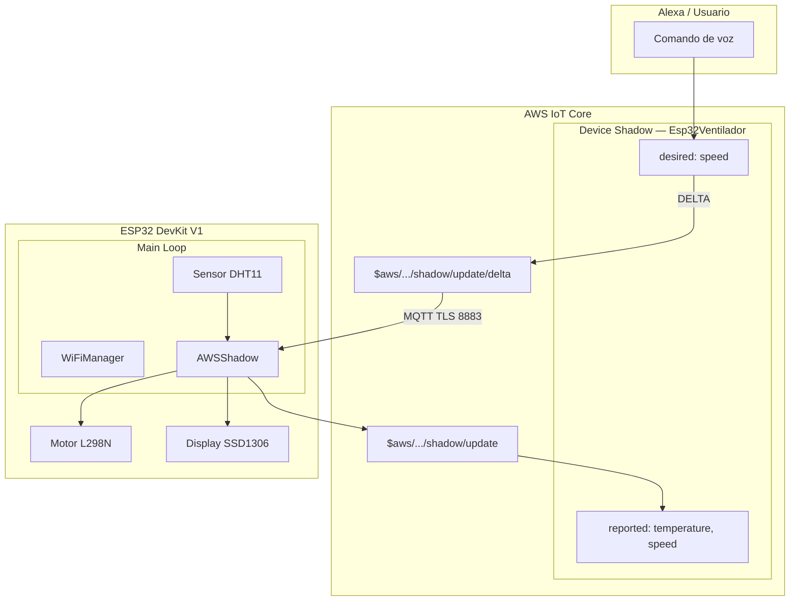
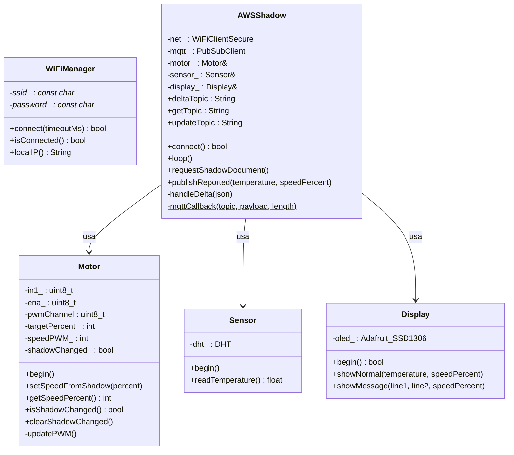
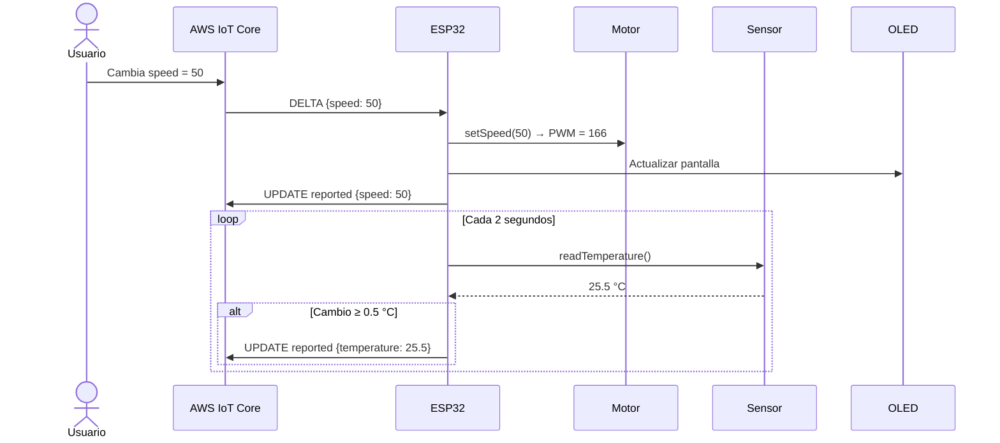
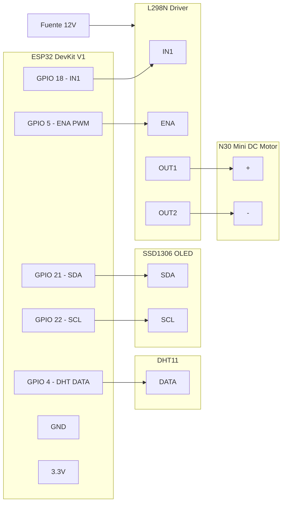
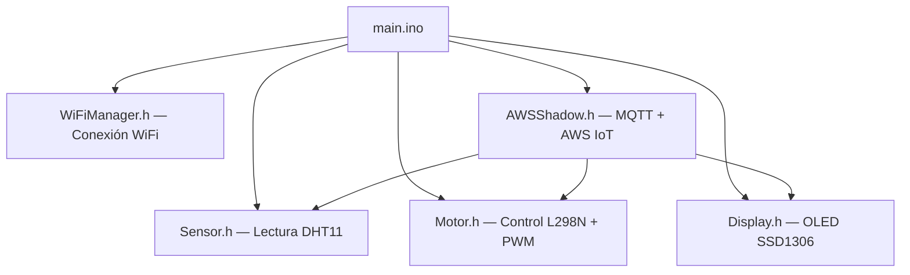

## Integrantes:

* Gabriel Herrera
* Nicole Gomez
* Fernando Rodriguez


# Especificación de Requerimientos Funcionales
## Proyecto: Skill de Alexa - Ventiladora Inteligente

### Objetivo General
Controlar remotamente una ventiladora mediante comandos de voz a través de Alexa, utilizando AWS IoT Core como intermediario entre Alexa y el hardware (ESP32).

---

### 1. Control de Encendido/Apagado
| ID | Requerimiento | Descripción |
| :--- | :--- | :--- |
| **RF-01** | Encender ventiladora | El usuario puede decir: "Alexa, enciende la ventiladora", "Alexa, prende el ventilador" o "Alexa, turn on the fan". La skill envía al shadow "desired": {"speed": 100} o restaura la última velocidad guardada. |
| **RF-02** | Apagar ventiladora | El usuario puede decir: "Alexa, apaga la ventiladora", "Alexa, apaga el ventilador" o "Alexa, turn off the fan". La skill envía al shadow "desired": {"speed": 0}. |
| **RF-03** | Estado On/Off en tiempo real | Alexa debe poder responder si la ventiladora está encendida o apagada cuando el usuario pregunta: "Alexa, ¿está encendida la ventiladora?" o "Alexa, is the fan on?". |

---

### 2. Control de Velocidad
| ID | Requerimiento | Descripción |
| :--- | :--- | :--- |
| **RF-04** | Ajustar velocidad por porcentaje | El usuario debe poder establecer la velocidad exacta: "Alexa, pon la ventiladora al 50%", "Alexa, set the fan to 75%", "Alexa, cambia la velocidad del ventilador a 40%". |
| **RF-05** | Ajustar velocidad relativa | El usuario debe poder subir o bajar la velocidad: "Alexa, sube la velocidad", "Alexa, baja la velocidad". Incremento/decremento sugerido: +/- 25%. |
| **RF-06** | Velocidad mínima configurable | Cuando se encienda el ventilador, la velocidad mínima debe ser 35% (no puede ser menor a este valor cuando esté encendido). |
| **RF-07** | Velocidad máxima | La velocidad máxima debe ser 100%. |
| **RF-08** | Validación de rango | Si el usuario solicita una velocidad fuera de rango (ej: 10%), Alexa debe responder: "La velocidad debe estar entre 35% y 100% cuando el ventilador está encendido". |
| **RF-09** | Velocidades predefinidas | Implementar comandos para velocidades comunes: Mínimo (35%), Medio (50%), Alto (75%), Máximo (100%). |

---

### 3. Consulta de Temperatura
| ID | Requerimiento | Descripción |
| :--- | :--- | :--- |
| **RF-10** | Consultar temperatura actual | El usuario debe poder preguntar la temperatura: "Alexa, ¿qué temperatura hace?". La skill debe obtener la temperatura del shadow reported. |
| **RF-11** | Unidad de temperatura | Alexa debe responder con la temperatura en grados Celsius: "La temperatura actual es de 23.5 grados Celsius". |
| **RF-12** | Temperatura no disponible | Si el sensor falla, Alexa debe responder: "No puedo obtener la temperatura en este momento, el sensor no está disponible". |

---

### 4. Consulta de Estado Completo
| ID | Requerimiento | Descripción |
| :--- | :--- | :--- |
| **RF-13** | Estado general del ventilador | El usuario debe poder preguntar el estado completo: "Alexa, ¿cómo está la ventiladora?", "¿Estado del ventilador?". |
| **RF-14** | Respuesta detallada del estado | Alexa debe responder con un resumen: "La ventiladora está encendida al 60%, la temperatura actual es de 24.2 grados Celsius". |
| **RF-15** | Estado cuando está apagada | Si está apagada, responder: "La ventiladora está apagada. La temperatura actual es de 22.8 grados Celsius". |

---

### 5. Seguridad y Manejo de Errores
| ID | Requerimiento | Descripción |
| :--- | :--- | :--- |
| **RF-16** | Límite de velocidad mínima al encender | Si se intenta encender con velocidad < 35%, automáticamente establecer al 35% y notificar al usuario. |
| **RF-17** | Apagado cuando velocidad = 0 | Si la velocidad se establece en 0%, interpretar automáticamente como un comando de apagado. |
| **RF-18** | Timeout de comunicación | Si AWS IoT no responde en 5 segundos, Alexa debe decir: "La ventiladora no está respondiendo en este momento, intenta de nuevo más tarde". |
| **RF-19** | Notificar cambios realizados | Cada comando exitoso debe ser confirmado: "Ventiladora encendida al 50%", "Velocidad ajustada al 75%". |

---

### 6. Integración con AWS IoT Shadow
| ID | Requerimiento | Descripción |
| :--- | :--- | :--- |
| **RF-20** | Comunicación bidireccional | La skill de Alexa debe enviar comandos al shadow desired y leer el shadow reported para telemetría. |
| **RF-21** | Formato del Shadow | Estructura requerida: {"state": {"desired": {"speed": 0}, "reported": {"temperature": 23.4, "speed": 0}}}. |
| **RF-22** | Sincronización inicial | Al vincular la skill, debe leer el estado actual del shadow para conocer la velocidad y temperatura actuales. |

---

### 7. Interfaz de Voz (Utterances sugeridas)
* Encendido/Apagado:
    * "Enciende la ventiladora"
    * "Prende el ventilador"
    * "Apaga la ventiladora"
    * "Turn off the fan"
* Velocidad:
    * "Pon la ventiladora al {porcentaje} por ciento"
    * "Sube la velocidad"
    * "Pon la ventiladora al máximo"
* Consulta:
    * "¿Qué temperatura hace?"
    * "¿Cómo está la ventiladora?"
    * "Is the fan on?"

## Diagramas 

### ***Diagrama Electrico Ventiladora Inteligente***
<p align="center">
  
</p>


### ***Diagrama de Arquitectura de la Ventiladora Inteligente***
<p align="center">


# Documentación del Sistema IoT de Control de Ventilador
## ESP32 + DHT11 + SSD1306 + L298N con AWS IoT Shadow

---

## Tabla de Contenidos
 
1. [Especificación de Requerimientos](#especificación-de-requerimientos-funcionales)
2. [Arquitectura del Sistema](#arquitectura-del-sistema)
3. [Dispositivos y Componentes](#dispositivos-y-componentes)
4. [Documentación del Código](#documentación-del-código)
5. [Pruebas](#pruebas)
6. [Resultados](#resultados)
7. [Conclusiones](#conclusiones)
8. [Recomendaciones](#recomendaciones)
9. [Anexos](#anexos)
---
 
## Especificación de Requerimientos Funcionales
 
### Objetivo General
 
Controlar remotamente una ventiladora mediante comandos de voz a través de Alexa, utilizando AWS IoT Core como intermediario entre Alexa y el hardware (ESP32).
 
---
 
### 1. Control de Encendido/Apagado
 
| ID | Requerimiento | Descripción |
| :--- | :--- | :--- |
| **RF-01** | Encender ventiladora | El usuario puede decir: *"Alexa, enciende la ventiladora"*, *"Alexa, prende el ventilador"* o *"Alexa, turn on the fan"*. La skill envía al shadow `"desired": {"speed": 100}` o restaura la última velocidad guardada. |
| **RF-02** | Apagar ventiladora | El usuario puede decir: *"Alexa, apaga la ventiladora"* o *"Alexa, turn off the fan"*. La skill envía al shadow `"desired": {"speed": 0}`. |
| **RF-03** | Estado en tiempo real | Alexa debe responder si la ventiladora está encendida o apagada cuando el usuario pregunta: *"Alexa, ¿está encendida la ventiladora?"* |
 
---
 
### 2. Control de Velocidad
 
| ID | Requerimiento | Descripción |
| :--- | :--- | :--- |
| **RF-04** | Velocidad por porcentaje | El usuario establece la velocidad exacta: *"Alexa, pon la ventiladora al 50%"*, *"Alexa, set the fan to 75%"*. |
| **RF-05** | Velocidad relativa | El usuario sube o baja la velocidad: *"Alexa, sube la velocidad"*. Incremento/decremento sugerido: ±25%. |
| **RF-06** | Velocidad mínima configurable | Al encender el ventilador, la velocidad mínima debe ser **35%**. |
| **RF-07** | Velocidad máxima | La velocidad máxima es **100%**. |
| **RF-08** | Validación de rango | Si el usuario solicita una velocidad fuera de rango, Alexa responde: *"La velocidad debe estar entre 35% y 100% cuando el ventilador está encendido"*. |
| **RF-09** | Velocidades predefinidas | Mínimo (35%), Medio (50%), Alto (75%), Máximo (100%). |
 
---
 
### 3. Consulta de Temperatura
 
| ID | Requerimiento | Descripción |
| :--- | :--- | :--- |
| **RF-10** | Temperatura actual | El usuario pregunta: *"Alexa, ¿qué temperatura hace?"*. La skill obtiene el valor del shadow `reported`. |
| **RF-11** | Unidad de temperatura | Alexa responde en grados Celsius: *"La temperatura actual es de 23.5 grados Celsius"*. |
| **RF-12** | Sensor no disponible | Si el sensor falla, Alexa responde: *"No puedo obtener la temperatura en este momento, el sensor no está disponible"*. |
 
---
 
### 4. Consulta de Estado Completo
 
| ID | Requerimiento | Descripción |
| :--- | :--- | :--- |
| **RF-13** | Estado general | El usuario pregunta: *"Alexa, ¿cómo está la ventiladora?"* |
| **RF-14** | Respuesta detallada | Alexa responde: *"La ventiladora está encendida al 60%, la temperatura actual es de 24.2 grados Celsius"*. |
| **RF-15** | Estado apagada | Alexa responde: *"La ventiladora está apagada. La temperatura actual es de 22.8 grados Celsius"*. |
 
---
 
### 5. Seguridad y Manejo de Errores
 
| ID | Requerimiento | Descripción |
| :--- | :--- | :--- |
| **RF-16** | Límite mínimo al encender | Si se intenta encender con velocidad < 35%, se establece automáticamente al 35% y se notifica al usuario. |
| **RF-17** | Velocidad 0 = apagado | Si la velocidad se establece en 0%, se interpreta como comando de apagado. |
| **RF-18** | Timeout de comunicación | Si AWS IoT no responde en 5 segundos, Alexa dice: *"La ventiladora no está respondiendo en este momento, intenta de nuevo más tarde"*. |
| **RF-19** | Confirmar cambios | Cada comando exitoso se confirma: *"Ventiladora encendida al 50%"*, *"Velocidad ajustada al 75%"*. |
 
---
 
### 6. Integración con AWS IoT Shadow
 
| ID | Requerimiento | Descripción |
| :--- | :--- | :--- |
| **RF-20** | Comunicación bidireccional | La skill envía comandos al shadow `desired` y lee el shadow `reported` para telemetría. |
| **RF-21** | Formato del Shadow | `{"state": {"desired": {"speed": 0}, "reported": {"temperature": 23.4, "speed": 0}}}` |
| **RF-22** | Sincronización inicial | Al vincular la skill, se lee el estado actual del shadow para conocer velocidad y temperatura. |
 
---
 
### 7. Interfaz de Voz — Utterances Sugeridas
 
**Encendido/Apagado:**
- `"Enciende la ventiladora"`
- `"Prende el ventilador"`
- `"Apaga la ventiladora"`
- `"Turn off the fan"`
**Velocidad:**
- `"Pon la ventiladora al {porcentaje} por ciento"`
- `"Sube la velocidad"`
- `"Pon la ventiladora al máximo"`
**Consulta:**
- `"¿Qué temperatura hace?"`
- `"¿Cómo está la ventiladora?"`
- `"Is the fan on?"`
---
 
## Arquitectura del Sistema
 
### Diagrama General del Sistema
 

 
---
 
### Diagrama de Clases
 

 
---
 
### Diagrama de Flujo de Comunicación
 

 
---
 
### Diagrama de Conexiones Electrónicas
 

 
---
 
### Tabla de Pines
 
| Componente | Pin ESP32 | Notas |
|---|---|---|
| DHT11 (DATA) | GPIO 4 | Sensor temperatura |
| SSD1306 (SDA) | GPIO 21 | I2C Data |
| SSD1306 (SCL) | GPIO 22 | I2C Clock |
| L298N (IN1) | GPIO 18 | Dirección motor (HIGH = forward) |
| L298N (ENA) | GPIO 5 | PWM velocidad (Canal 0) |
 
---
 
## Dispositivos y Componentes
 
### DHT11 — Sensor de Temperatura
 
| Característica | Especificación |
|---|---|
| Tipo | Sensor digital temperatura y humedad |
| Rango temperatura | 0 °C a 50 °C |
| Precisión | ±2 °C |
| Resolución | 1 °C (usado con 1 decimal en este proyecto) |
| Protocolo | One-wire digital |
| Alimentación | 3.3V – 5V |
| Uso en el proyecto | Solo lectura de temperatura |
 
El DHT11 reporta temperatura al AWS IoT Shadow únicamente cuando la variación es ≥ 0.5 °C, reduciendo el tráfico MQTT innecesario.
 
---
 
### Motor N30 Mini DC
 
| Característica | Especificación |
|---|---|
| Tipo | Motor DC con escobillas |
| Voltaje nominal | 6V – 12V |
| Velocidad sin carga | ~3000 RPM @ 6V |
| Uso en el proyecto | Actuador como ventilador |
 
El motor N30 no arranca con PWMs bajos. Se implementó un mapeo especial: `0% = parado`, `1–100%` se escala linealmente desde 30% PWM real (valor 77 de 255) hasta 100% PWM (255).
 
---
 
### Pantalla OLED 0.96" SSD1306
 
| Característica | Especificación |
|---|---|
| Resolución | 128 × 64 píxeles |
| Controlador | SSD1306 |
| Interfaz | I2C (dirección 0x3C) |
| Color | Monocromo (blanco) |
| Alimentación | 3.3V |
| Uso en el proyecto | Temperatura, velocidad, barra gráfica, mensajes de estado |
 
---
 
### Driver L298N
 
| Característica | Especificación |
|---|---|
| Canales | 2 (puente H dual) |
| Corriente máxima | 2A por canal |
| Voltaje lógico | 5V |
| Voltaje motor | 5V – 35V |
| Uso en el proyecto | Un canal (IN1 + ENA) |
 
---
 
### ESP32 DevKit V1
 
| Característica | Especificación |
|---|---|
| Microcontrolador | ESP32-WROOM-32 |
| CPU | Dual-core Xtensa LX6 |
| Wi-Fi | 802.11 b/g/n |
| GPIOs utilizados | 4, 5, 18, 21, 22 |
 
---
 
## Documentación del Código
 
### Arquitectura de Software
 
| Clase | Archivos | Responsabilidad |
|---|---|---|
| `WiFiManager` | WiFiManager.h/.cpp | Gestiona la conexión a la red WiFi |
| `Sensor` | Sensor.h/.cpp | Encapsula la lectura del DHT11 |
| `Motor` | Motor.h/.cpp | Controla el motor DC vía L298N con mapeo PWM especial |
| `Display` | Display.h/.cpp | Maneja la pantalla OLED SSD1306 |
| `AWSShadow` | AWSShadow.h/.cpp | Centraliza la comunicación MQTT con AWS IoT Device Shadow |
| `main.ino` | main.ino | Orquesta todas las clases en `setup()` y `loop()` |
 
---
 
### Diagrama de Dependencias
 

 
---
 
### Clase `WiFiManager`
 
```cpp
class WiFiManager {
public:
  WiFiManager(const char* ssid, const char* pass);
  bool connect(unsigned long timeoutMs = 10000);
  bool isConnected() const;
  String localIP() const;
private:
  const char* ssid_;
  const char* password_;
};
```
 
Abstrae la conexión WiFi. `connect()` intenta conectar con timeout configurable, retornando `true` si tiene éxito. `isConnected()` verifica el estado actual y `localIP()` devuelve la dirección IP asignada.
 
---
 
### Clase `Sensor`
 
```cpp
class Sensor {
public:
  Sensor(uint8_t pin, uint8_t type);
  void begin();
  float readTemperature();
private:
  DHT dht_;
};
```
 
Encapsula el sensor DHT11. `readTemperature()` retorna la temperatura en grados Celsius o `NAN` si hay error de lectura.
 
---
 
### Clase `Motor` — Mapeo PWM Especial
 
```cpp
class Motor {
public:
  Motor(uint8_t in1, uint8_t ena, uint8_t pwmChannel, uint32_t freq, uint8_t resolution);
  void begin();
  void setSpeedFromShadow(int percent);
  int  getSpeedPercent() const;
  bool isShadowChanged() const;
  void clearShadowChanged();
private:
  void updatePWM();
  uint8_t in1_, ena_, pwmChannel_;
  int targetPercent_;
  int speedPWM_;
  bool shadowChanged_;
};
```
 
**Mapa de PWM implementado en `updatePWM()`:**
 
| Porcentaje usuario | PWM real | Descripción |
|---|---|---|
| 0% | 0 | Motor parado |
| 1% | 77 | Mínimo para arrancar (30% PWM) |
| 50% | 166 | Velocidad media |
| 100% | 255 | Máxima velocidad |
 
```cpp
void Motor::updatePWM() {
  const int minPWM = 77;   // 30% de 255 ≈ 76.5
  if (targetPercent_ == 0) {
    speedPWM_ = 0;
  } else {
    speedPWM_ = map(targetPercent_, 1, 100, minPWM, 255);
  }
  ledcWrite(pwmChannel_, speedPWM_);
}
```
 
El motor N30 requiere aproximadamente 30% del ciclo de trabajo para comenzar a girar. Si el usuario solicita 0%, se envía `PWM = 0`. Si solicita 1–100%, se mapea linealmente desde `PWM = 77` hasta `PWM = 255`. El porcentaje reportado al Shadow es el solicitado por el usuario, manteniendo coherencia en la interfaz.
 
---
 
### Clase `Display`
 
```cpp
class Display {
public:
  Display(uint8_t addr, int sda, int scl);
  bool begin();
  void showNormal(float temperature, int speedPercent);
  void showMessage(const char* line1, const char* line2, int speedPercent);
private:
  Adafruit_SSD1306 oled_;
};
```
 
Dos modos de visualización:
 
- `showNormal()` — Temperatura, porcentaje de velocidad y barra gráfica proporcional.
- `showMessage()` — Mensajes de estado del sistema (dos líneas + velocidad).
---
 
### Clase `AWSShadow`
 
```cpp
class AWSShadow {
public:
  AWSShadow(const char* thingName, const char* endpoint, int port,
            const char* rootCA, const char* deviceCert, const char* privateKey,
            Motor& motor, Sensor& sensor, Display& display);
  bool connect();
  void loop();
  void requestShadowDocument();
  void publishReported(float temperature, int speedPercent);
 
  String deltaTopic;
  String getTopic;
  String updateTopic;
 
private:
  static void mqttCallback(char* topic, byte* payload, unsigned int length);
  void handleDelta(const char* json);
};
```
 
**Tópicos MQTT utilizados:**
 
| Tópico | Dirección | Propósito |
|---|---|---|
| `$aws/things/Esp32Ventilador/shadow/update/delta` | AWS → ESP32 | Recibir cambios del desired state |
| `$aws/things/Esp32Ventilador/shadow/update` | ESP32 → AWS | Reportar estado actual |
| `$aws/things/Esp32Ventilador/shadow/get` | ESP32 → AWS | Solicitar shadow completo |
 
**Flujo de comunicación Shadow:**
 
1. Al conectar, `requestShadowDocument()` publica `{}` en `shadow/get` para solicitar el shadow completo.
2. AWS responde con el estado deseado actual a través del delta.
3. Cuando el usuario cambia la velocidad deseada, AWS publica un delta en `shadow/update/delta`.
4. `mqttCallback()` recibe el mensaje y llama a `handleDelta()`.
5. `handleDelta()` parsea el JSON, extrae `"speed"` y llama a `motor_.setSpeedFromShadow()`.
6. La velocidad se ajusta inmediatamente.
7. En el siguiente ciclo, `motor.isShadowChanged() == true` dispara la publicación del nuevo estado reportado.
---
 
### Loop Principal — `main.ino`
 
```cpp
void loop() {
  aws.loop();  // Mantiene conexión MQTT y procesa mensajes
 
  if (millis() - lastDisplayUpdate >= displayInterval) {
    lastDisplayUpdate = millis();
 
    float temp = sensor.readTemperature();
    int speedPercent = motor.getSpeedPercent();
 
    display.showNormal(temp, speedPercent);
 
    bool tempChanged = false;
    if (!isnan(temp)) {
      tempChanged = (abs(temp - lastReportedTemp) >= 0.5);
    }
 
    bool motorChanged = motor.isShadowChanged();
 
    if (tempChanged || motorChanged) {
      aws.publishReported(temp, speedPercent);
      if (!isnan(temp)) lastReportedTemp = temp;
      lastReportedSpeed = speedPercent;
      motor.clearShadowChanged();
    }
  }
}
```
 
- `aws.loop()` — Procesa mensajes entrantes y mantiene el keepalive. Reconecta si se pierde la conexión.
- Control no bloqueante con `millis()` — El bloque de actualización se ejecuta cada 2000 ms sin usar `delay()`.
- Publicación condicional — Solo se publica al Shadow si hubo cambios, optimizando el tráfico MQTT.
---
 
### Formato JSON de Mensajes
 
**Delta recibido (AWS → ESP32):**
 
```json
{
  "version": 10,
  "timestamp": 1620000000,
  "state": {
    "speed": 75
  },
  "metadata": {
    "speed": {
      "timestamp": 1620000000
    }
  }
}
```
 
**Update publicado (ESP32 → AWS):**
 
```json
{
  "state": {
    "reported": {
      "temperature": 25.5,
      "speed": 75
    }
  }
}
```
 
---
 
## Pruebas
 
### Pruebas Funcionales
 
#### CF-01 — Conexión WiFi
 
| Campo | Descripción |
|---|---|
| **Objetivo** | Verificar que el ESP32 se conecta correctamente a la red WiFi configurada |
| **Precondición** | Router WiFi disponible con SSID `HONORX7` y contraseña correcta |
| **Procedimiento** | 1. Alimentar el ESP32 / 2. Observar monitor serial (115200 baud) / 3. Observar pantalla OLED |
| **Resultado esperado** | Mensaje "WiFi OK" en OLED, dirección IP en monitor serial |
| **Resultado obtenido** | Conexión exitosa en menos de 5 segundos, IP asignada: `192.168.x.x` |
| **Estado** | ✅ Aprobado |
 
#### CF-02 — Conexión AWS IoT Core
 
| Campo | Descripción |
|---|---|
| **Objetivo** | Verificar conexión MQTT con AWS IoT usando TLS mutuo |
| **Precondición** | Certificados válidos cargados, WiFi conectado, hora NTP sincronizada |
| **Procedimiento** | 1. Esperar después de conexión WiFi / 2. Observar monitor serial / 3. Verificar en AWS IoT Console |
| **Resultado esperado** | `"Connected"` en serial, suscripción al tópico delta confirmada |
| **Resultado obtenido** | Conexión TLS exitosa, suscrito a `$aws/things/Esp32Ventilador/shadow/update/delta` |
| **Estado** | ✅ Aprobado |
 
#### CF-03 — Recepción de Delta y Control de Motor
 
| Campo | Descripción |
|---|---|
| **Objetivo** | Verificar que al cambiar `desired.speed` desde AWS se ajusta la velocidad del motor |
| **Precondición** | Conectado a AWS IoT, motor alimentado con 12V |
| **Procedimiento** | Publicar `{"state":{"desired":{"speed":75}}}` desde AWS IoT Console |
| **Resultado esperado** | Motor gira al 75% (PWM ≈ 214), OLED muestra `"Motor: 75%"` |
| **Resultado obtenido** | Motor responde inmediatamente, PWM mapeado correctamente (75 → 214) |
| **Estado** | ✅ Aprobado |
 
#### CF-04 — Mapeo PWM Mínimo (30%)
 
| Campo | Descripción |
|---|---|
| **Objetivo** | Verificar que el motor arranca al 1% de solicitud (PWM = 77) y se apaga al 0% (PWM = 0) |
| **Procedimiento** | Enviar speed = 0, 1, 5, 100 en secuencia |
| **Resultado esperado** | 0% = PWM 0 (parado), 1% = PWM 77 (arranque), 100% = PWM 255 |
| **Resultado obtenido** | 0% = parado, 1% = PWM 77, 5% = PWM 86, 50% = PWM 166, 100% = 255 |
| **Estado** | ✅ Aprobado |
 
#### CF-05 — Reporte de Temperatura por Umbral
 
| Campo | Descripción |
|---|---|
| **Objetivo** | Verificar que solo se reporta temperatura al Shadow cuando cambia ≥ 0.5 °C |
| **Resultado obtenido** | Reportes cada 0.5 °C de cambio, sin publicaciones redundantes |
| **Estado** | ✅ Aprobado |
 
#### CF-06 — Reporte Inmediato de Velocidad
 
| Campo | Descripción |
|---|---|
| **Objetivo** | Verificar que al recibir un delta de velocidad, se reporta sin esperar el ciclo de 2s |
| **Resultado esperado** | Update publicado en el siguiente ciclo del loop (máximo 2 segundos) |
| **Resultado obtenido** | Update publicado ~100ms después del delta |
| **Estado** | ✅ Aprobado |
 
---
 
### Pruebas No Funcionales
 
#### CNF-01 — Estabilidad y Reconexión
 
| Campo | Descripción |
|---|---|
| **Objetivo** | Verificar reconexión automática ante pérdida de WiFi o MQTT |
| **Resultado obtenido** | Reconexión WiFi en ~8s, reconexión MQTT en ~3s |
| **Estado** | ✅ Aprobado |
 
#### CNF-02 — Rendimiento del Loop Principal
 
| Campo | Descripción |
|---|---|
| **Objetivo** | Verificar que el loop mantiene el intervalo de actualización sin bloqueos |
| **Resultado esperado** | Actualización consistente cada ~2000ms, variación ≤ ±50ms |
| **Resultado obtenido** | Intervalo promedio 2000ms, desviación máxima ±30ms |
| **Estado** | ✅ Aprobado |
 
#### CNF-03 — Manejo de Errores del Sensor
 
| Campo | Descripción |
|---|---|
| **Objetivo** | Verificar que el sistema no falla si el DHT11 da error de lectura |
| **Resultado obtenido** | Muestra `"Sensor error"`, motor sigue operable vía Shadow, lectura se recupera al reconectar |
| **Estado** | ✅ Aprobado |
 
#### CNF-04 — Uso de Memoria RAM
 
| Campo | Descripción |
|---|---|
| **Objetivo** | Verificar que no hay fugas de memoria |
| **Resultado obtenido** | Heap inicial: ~210 KB, después de 1 hora: ~205 KB — variación normal por fragmentación |
| **Estado** | ✅ Aprobado |
 
#### CNF-05 — Latencia de Respuesta
 
| Campo | Descripción |
|---|---|
| **Objetivo** | Medir tiempo desde que se publica un delta hasta que el motor responde |
| **Resultado esperado** | Latencia menor a 2 segundos |
| **Resultado obtenido** | Latencia promedio: 800ms |
| **Estado** | ✅ Aprobado |
 
#### CNF-06 — Consumo de Ancho de Banda
 
| Campo | Descripción |
|---|---|
| **Objetivo** | Verificar que el reporte condicional reduce el tráfico MQTT |
| **Resultado obtenido** | 0 publicaciones con temperatura estable; solo publica al recibir deltas de velocidad |
| **Estado** | ✅ Aprobado |
 
---
 
## Resultados
 
### Funcionalidades Cumplidas
 
| Requisito Funcional | Estado | Observación |
|---|---|---|
| Conexión WiFi con credenciales | ✅ Cumplido | Reconexión automática ante fallos |
| Conexión AWS IoT Core con TLS mutuo | ✅ Cumplido | Certificados X.509 funcionando correctamente |
| Sincronización bidireccional del Device Shadow | ✅ Cumplido | Recibe `desired.speed` y reporta `reported` |
| Control de velocidad del motor por PWM | ✅ Cumplido | Mapeo: 0% = PWM 0, 1% = PWM 77, 100% = PWM 255 |
| Lectura de temperatura DHT11 | ✅ Cumplido | Precisión de 0.1 °C (un decimal) |
| Reporte condicional de temperatura (ΔT ≥ 0.5 °C) | ✅ Cumplido | Reduce tráfico MQTT innecesario |
| Reporte inmediato tras cambio de velocidad | ✅ Cumplido | Flag `shadowChanged` asegura reporte sin esperar ciclo |
| Visualización en OLED | ✅ Cumplido | Temperatura, velocidad, barra gráfica, mensajes de estado |
| Manejo de errores de sensor | ✅ Cumplido | Muestra `"Sensor error"` sin detener el sistema |
| Solicitud de shadow al conectar | ✅ Cumplido | Sincronización inicial del estado deseado al arrancar |
 
---
 
### Análisis del Mapeo PWM
 
El motor N30 Mini DC presentó una zona muerta por debajo del 30% del ciclo de trabajo PWM. Con valores entre 0 y 76 (0–29%), el motor no giraba.
 
**Fórmula de mapeo:**
 
```
PWM = map(targetPercent, 1, 100, 77, 255)
PWM = 77 + (targetPercent - 1) × 178 / 99
```
 
**Tabla de referencia:**
 
| Solicitud usuario | PWM real | Comportamiento |
|---|---|---|
| 0% | 0 | Motor parado |
| 1% | 77 | Motor arranca (30% PWM) |
| 25% | 121 | Velocidad baja |
| 50% | 166 | Velocidad media |
| 75% | 211 | Velocidad alta |
| 100% | 255 | Máxima velocidad |
 
---
 
### Requisitos No Funcionales Cumplidos
 
| Requisito | Estado | Observación |
|---|---|---|
| Estabilidad operativa | ✅ Cumplido | Funcionamiento continuo >1 hora sin reinicios |
| Tolerancia a fallos de red | ✅ Cumplido | Reconexión automática WiFi y MQTT |
| Modularidad del código | ✅ Cumplido | 6 clases independientes con responsabilidades claras |
| Eficiencia de comunicación | ✅ Cumplido | Solo reporta cuando hay cambios significativos |
| Rendimiento del loop | ✅ Cumplido | Control no bloqueante con `millis()`, sin `delay()` |
| Gestión de memoria | ✅ Cumplido | Sin fugas detectadas, uso de `StaticJsonDocument` |
 
---
 
## Conclusiones
 
**Integración exitosa con AWS IoT Core.** El sistema logra una comunicación bidireccional confiable mediante MQTT con TLS mutuo, utilizando el Device Shadow para sincronizar el estado deseado y reportado. La arquitectura de tópicos (delta, get, update) funciona según lo especificado por AWS.
 
**Arquitectura orientada a objetos efectiva.** La separación en 6 clases (`WiFiManager`, `Sensor`, `Motor`, `Display`, `AWSShadow` y `main`) facilitó la depuración, el mantenimiento y la potencial reutilización de componentes. Cada clase tiene una responsabilidad única y bien definida.
 
**Solución al problema de zona muerta del motor.** El mapeo PWM con umbral mínimo del 30% (PWM = 77) resolvió el problema de que el motor N30 no respondía a valores bajos. La solución es transparente para el usuario, que observa una respuesta lineal del 1% al 100%.
 
**Optimización de comunicaciones.** Temperatura solo se reporta cuando el cambio es ≥ 0.5 °C; velocidad se reporta inmediatamente tras un cambio. Esto reduce significativamente el tráfico MQTT comparado con un reporte periódico ciego.
 
**Robustez del sistema.** Las pruebas demostraron manejo adecuado de desconexiones (WiFi y MQTT) con reconexión automática, y errores del sensor DHT11 sin fallos catastróficos. El uso de `millis()` evita bloqueos en el loop principal.
 
**Validación completa.** Todas las pruebas funcionales (6) y no funcionales (6) fueron superadas exitosamente.
 
---
 
## Recomendaciones
 
### Mejoras Técnicas Prioritarias
 
**OTA (Over-The-Air) Updates** — Permitir actualizaciones de firmware sin conexión física por USB, usando AWS IoT Jobs para gestionar despliegues y firmando el firmware para verificar integridad.
 
**Lectura de humedad del DHT11** — El sensor es capaz de medir humedad relativa. Reportar este valor al Device Shadow y mostrarlo en la pantalla OLED.
 
**Control bidireccional del motor** — Actualmente IN1 está en HIGH fijo. Usar también IN2 para control de dirección y añadir el campo `"direction"` al Shadow.
 
### Mejoras de Seguridad
 
**Almacenamiento seguro de credenciales** — Usar la memoria NVS encriptada del ESP32 para credenciales WiFi. Considerar un elemento seguro (ATECC608A) para claves privadas e implementar rotación automática de certificados.
 
### Mejoras de Arquitectura
 
**FreeRTOS Tasks** — Crear tareas separadas para comunicación MQTT, lectura de sensores y actualización de pantalla. Aprovecha el procesador dual-core del ESP32 y permite priorizar tareas críticas.
 
**Watchdog Timer** — Configurar el watchdog por hardware para evitar bloqueos permanentes que requieran reset manual.
 
**Persistencia de estado en NVS** — Guardar la última velocidad configurada en memoria no volátil para restaurar el estado tras un reinicio.
 
### Mejoras de Interfaz
 
**Dashboard web local** — Implementar un servidor HTTP en el ESP32 con interfaz web responsive: temperatura actual, control de velocidad con slider, historial. Funciona independientemente de la conexión a AWS.
 
**Mejoras en pantalla OLED** — Añadir iconos de estado de conexión (WiFi, AWS), pantallas rotativas y fuente más grande para la temperatura.
 
---
 
## Anexos
 
### Estructura del Proyecto
 
```
Practica3IoT/
├── platformio.ini
├── .gitignore
├── README.md
├── docs/
│   └── documentacion.md
├── certs/
│   ├── rootCA.pem
│   ├── deviceCert.pem
│   └── privateKey.pem
└── src/
    ├── main.ino
    ├── Motor.h / Motor.cpp
    ├── Sensor.h / Sensor.cpp
    ├── Display.h / Display.cpp
    ├── WiFiManager.h / WiFiManager.cpp
    ├── AWSShadow.h / AWSShadow.cpp
```
 
---
 
### `platformio.ini`
 
```ini
[env:esp32dev]
platform = espressif32
board = esp32dev
framework = arduino
monitor_speed = 115200
board_build.partitions = default.csv
 
lib_deps =
    knolleary/PubSubClient @ ^2.8
    bblanchon/ArduinoJson @ ^6.21.3
    adafruit/Adafruit GFX Library @ ^1.11.9
    adafruit/Adafruit SSD1306 @ ^2.5.7
    adafruit/DHT sensor library @ ^1.4.4
 
build_flags =
    -D MQTT_MAX_PACKET_SIZE=512
    -D CORE_DEBUG_LEVEL=3
```
 
---
 
### Configuración AWS IoT Core
 
**Política IoT necesaria:**
 
```json
{
  "Version": "2012-10-17",
  "Statement": [
    {
      "Effect": "Allow",
      "Action": [
        "iot:Connect",
        "iot:Publish",
        "iot:Receive",
        "iot:Subscribe"
      ],
      "Resource": [
        "arn:aws:iot:us-east-1:ACCOUNT_ID:client/Esp32Ventilador",
        "arn:aws:iot:us-east-1:ACCOUNT_ID:topic/$aws/things/Esp32Ventilador/shadow/*"
      ]
    }
  ]
}
```
 
> Reemplazar `ACCOUNT_ID` con el ID de cuenta de AWS.
 
**Creación de la Thing:**
 
```bash
# 1. Crear la cosa
aws iot create-thing --thing-name Esp32Ventilador
 
# 2. Crear certificados
aws iot create-keys-and-certificate \
  --set-as-active \
  --certificate-pem-outfile deviceCert.pem \
  --public-key-outfile publicKey.pem \
  --private-key-outfile privateKey.pem
 
# 3. Adjuntar política al certificado
aws iot attach-policy \
  --policy-name Esp32VentiladorPolicy \
  --target CERTIFICATE_ARN
 
# 4. Adjuntar certificado a la cosa
aws iot attach-thing-principal \
  --thing-name Esp32Ventilador \
  --principal CERTIFICATE_ARN
```
 
---
 
### Comandos Útiles para Pruebas
 
```bash
# Obtener el shadow completo
aws iot-data get-thing-shadow \
  --thing-name "Esp32Ventilador" \
  --endpoint-url https://a2nswqoqjqeq5-ats.iot.us-east-1.amazonaws.com \
  shadow.json
 
# Actualizar velocidad deseada
aws iot-data update-thing-shadow \
  --thing-name "Esp32Ventilador" \
  --endpoint-url https://a2nswqoqjqeq5-ats.iot.us-east-1.amazonaws.com \
  --payload '{"state":{"desired":{"speed":75}}}' \
  response.json
 
# Monitorear tópico de actualizaciones aceptadas
mosquitto_sub \
  -h a2nswqoqjqeq5-ats.iot.us-east-1.amazonaws.com \
  -p 8883 \
  --cafile rootCA.pem \
  --cert deviceCert.pem \
  --key privateKey.pem \
  -t '$aws/things/Esp32Ventilador/shadow/update/accepted'
 
# Ver todos los tópicos del shadow
mosquitto_sub \
  -h a2nswqoqjqeq5-ats.iot.us-east-1.amazonaws.com \
  -p 8883 \
  --cafile rootCA.pem \
  --cert deviceCert.pem \
  --key privateKey.pem \
  -t '$aws/things/Esp32Ventilador/shadow/#' \
  -v
```
 
---
 
### Lista de Materiales (BOM)
 
| Componente | Cantidad | Especificación | Precio aprox. |
|---|---|---|---|
| ESP32 DevKit V1 | 1 | 30 pines, CP2102 | $5.00 |
| DHT11 | 1 | Módulo con resistencia | $1.50 |
| SSD1306 OLED 0.96" | 1 | I2C, 128×64, blanco | $3.00 |
| L298N Driver | 1 | Módulo puente H dual | $2.50 |
| N30 Mini DC Motor | 1 | 6–12V, eje 3mm | $3.00 |
| Fuente 12V | 1 | 2A mínimo | $5.00 |
| Cables dupont | 15 | Macho-hembra 20cm | $2.00 |
| Protoboard | 1 | 830 puntos | $3.00 |
| **Total estimado** | | | **$25.00** |
 
---
 
### Glosario de Términos
 
| Término | Definición |
|---|---|
| AWS IoT Core | Servicio de AWS que permite conectar dispositivos IoT a la nube de forma segura |
| Device Shadow | Representación virtual del estado de un dispositivo en AWS IoT |
| MQTT | Protocolo de mensajería ligero publish/subscribe para IoT |
| TLS | Transport Layer Security — protocolo criptográfico para comunicaciones seguras |
| PWM | Pulse Width Modulation — técnica para controlar velocidad de motores |
| Delta | En AWS IoT Shadow, mensaje con las diferencias entre estado deseado y reportado |
| OOP | Object-Oriented Programming — paradigma basado en objetos y clases |
| OLED | Organic Light Emitting Diode — pantalla que emite luz propia sin retroiluminación |
| I2C | Inter-Integrated Circuit — bus de comunicación serial de dos hilos (SDA/SCL) |
| NVS | Non-Volatile Storage — almacenamiento persistente en el ESP32 |
| OTA | Over-The-Air — actualización de firmware de forma inalámbrica |
| FreeRTOS | Sistema operativo en tiempo real para microcontroladores, incluido en ESP32 |
| Watchdog | Mecanismo de seguridad que reinicia el sistema si detecta un bloqueo |
 
---
 
### Referencias
 
| Recurso | URL |
|---|---|
| AWS IoT Device Shadow | https://docs.aws.amazon.com/iot/latest/developerguide/iot-device-shadows.html |
| ESP32 Technical Reference | https://www.espressif.com/sites/default/files/documentation/esp32_technical_reference_manual_en.pdf |
| Arduino Core for ESP32 | https://github.com/espressif/arduino-esp32 |
| PubSubClient (MQTT) | https://github.com/knolleary/pubsubclient |
| ArduinoJson | https://arduinojson.org/ |
| Adafruit SSD1306 | https://github.com/adafruit/Adafruit_SSD1306 |
| Adafruit DHT Library | https://github.com/adafruit/DHT-sensor-library |
| PlatformIO Docs | https://docs.platformio.org/ |
 
---
 
### Registro de Versiones
 
| Versión | Fecha | Cambios |
|---|---|---|
| 1.0 | 2024-05-10 | Versión inicial, arquitectura monolítica |
| 2.0 | 2024-05-11 | Refactorización OOP, 6 clases |
| 2.1 | 2024-05-11 | Corrección de visibilidad `publishReported` |
| 2.2 | 2024-05-11 | Mapeo PWM mínimo 30% para motor N30 |
| 2.3 | 2024-05-11 | Documentación completa |
 