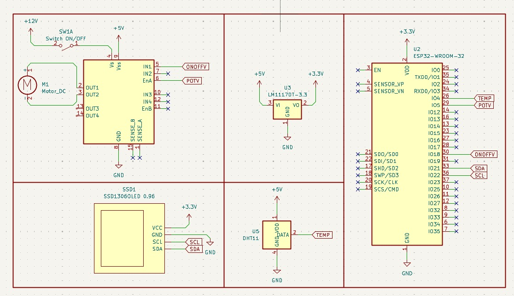

## Integrantes:

* Gabriel Herrera
* Nicole Gomez
* Fernando Rodriguez


# Especificación de Requerimientos Funcionales
## Proyecto: Skill de Alexa - Ventiladora Inteligente

### Objetivo General
Controlar remotamente una ventiladora mediante comandos de voz a través de Alexa, utilizando AWS IoT Core como intermediario entre Alexa y el hardware (ESP32).

---

### 1. Control de Encendido/Apagado
| ID | Requerimiento | Descripción |
| :--- | :--- | :--- |
| **RF-01** | Encender ventiladora | El usuario puede decir: "Alexa, enciende la ventiladora", "Alexa, prende el ventilador" o "Alexa, turn on the fan". La skill envía al shadow "desired": {"speed": 100} o restaura la última velocidad guardada. |
| **RF-02** | Apagar ventiladora | El usuario puede decir: "Alexa, apaga la ventiladora", "Alexa, apaga el ventilador" o "Alexa, turn off the fan". La skill envía al shadow "desired": {"speed": 0}. |
| **RF-03** | Estado On/Off en tiempo real | Alexa debe poder responder si la ventiladora está encendida o apagada cuando el usuario pregunta: "Alexa, ¿está encendida la ventiladora?" o "Alexa, is the fan on?". |

---

### 2. Control de Velocidad
| ID | Requerimiento | Descripción |
| :--- | :--- | :--- |
| **RF-04** | Ajustar velocidad por porcentaje | El usuario debe poder establecer la velocidad exacta: "Alexa, pon la ventiladora al 50%", "Alexa, set the fan to 75%", "Alexa, cambia la velocidad del ventilador a 40%". |
| **RF-05** | Ajustar velocidad relativa | El usuario debe poder subir o bajar la velocidad: "Alexa, sube la velocidad", "Alexa, baja la velocidad". Incremento/decremento sugerido: +/- 25%. |
| **RF-06** | Velocidad mínima configurable | Cuando se encienda el ventilador, la velocidad mínima debe ser 35% (no puede ser menor a este valor cuando esté encendido). |
| **RF-07** | Velocidad máxima | La velocidad máxima debe ser 100%. |
| **RF-08** | Validación de rango | Si el usuario solicita una velocidad fuera de rango (ej: 10%), Alexa debe responder: "La velocidad debe estar entre 35% y 100% cuando el ventilador está encendido". |
| **RF-09** | Velocidades predefinidas | Implementar comandos para velocidades comunes: Mínimo (35%), Medio (50%), Alto (75%), Máximo (100%). |

---

### 3. Consulta de Temperatura
| ID | Requerimiento | Descripción |
| :--- | :--- | :--- |
| **RF-10** | Consultar temperatura actual | El usuario debe poder preguntar la temperatura: "Alexa, ¿qué temperatura hace?". La skill debe obtener la temperatura del shadow reported. |
| **RF-11** | Unidad de temperatura | Alexa debe responder con la temperatura en grados Celsius: "La temperatura actual es de 23.5 grados Celsius". |
| **RF-12** | Temperatura no disponible | Si el sensor falla, Alexa debe responder: "No puedo obtener la temperatura en este momento, el sensor no está disponible". |

---

### 4. Consulta de Estado Completo
| ID | Requerimiento | Descripción |
| :--- | :--- | :--- |
| **RF-13** | Estado general del ventilador | El usuario debe poder preguntar el estado completo: "Alexa, ¿cómo está la ventiladora?", "¿Estado del ventilador?". |
| **RF-14** | Respuesta detallada del estado | Alexa debe responder con un resumen: "La ventiladora está encendida al 60%, la temperatura actual es de 24.2 grados Celsius". |
| **RF-15** | Estado cuando está apagada | Si está apagada, responder: "La ventiladora está apagada. La temperatura actual es de 22.8 grados Celsius". |

---

### 5. Seguridad y Manejo de Errores
| ID | Requerimiento | Descripción |
| :--- | :--- | :--- |
| **RF-16** | Límite de velocidad mínima al encender | Si se intenta encender con velocidad < 35%, automáticamente establecer al 35% y notificar al usuario. |
| **RF-17** | Apagado cuando velocidad = 0 | Si la velocidad se establece en 0%, interpretar automáticamente como un comando de apagado. |
| **RF-18** | Timeout de comunicación | Si AWS IoT no responde en 5 segundos, Alexa debe decir: "La ventiladora no está respondiendo en este momento, intenta de nuevo más tarde". |
| **RF-19** | Notificar cambios realizados | Cada comando exitoso debe ser confirmado: "Ventiladora encendida al 50%", "Velocidad ajustada al 75%". |

---

### 6. Integración con AWS IoT Shadow
| ID | Requerimiento | Descripción |
| :--- | :--- | :--- |
| **RF-20** | Comunicación bidireccional | La skill de Alexa debe enviar comandos al shadow desired y leer el shadow reported para telemetría. |
| **RF-21** | Formato del Shadow | Estructura requerida: {"state": {"desired": {"speed": 0}, "reported": {"temperature": 23.4, "speed": 0}}}. |
| **RF-22** | Sincronización inicial | Al vincular la skill, debe leer el estado actual del shadow para conocer la velocidad y temperatura actuales. |

---

### 7. Interfaz de Voz (Utterances sugeridas)
* Encendido/Apagado:
    * "Enciende la ventiladora"
    * "Prende el ventilador"
    * "Apaga la ventiladora"
    * "Turn off the fan"
* Velocidad:
    * "Pon la ventiladora al {porcentaje} por ciento"
    * "Sube la velocidad"
    * "Pon la ventiladora al máximo"
* Consulta:
    * "¿Qué temperatura hace?"
    * "¿Cómo está la ventiladora?"
    * "Is the fan on?"

## Diagramas 

### ***Diagrama Electrico Ventiladora Inteligente***
<p align="center">
  
</p>


### ***Diagrama de Arquitectura de la Ventiladora Inteligente***
<p align="center">


# Documentación del Sistema IoT de Control de Ventilador
## ESP32 + DHT11 + SSD1306 + L298N con AWS IoT Shadow

---

## Tabla de Contenidos

1. [Arquitectura del Sistema](#1-arquitectura-del-sistema)
2. [Dispositivos y Componentes](#2-dispositivos-y-componentes)
3. [Documentación del Código](#3-documentación-del-código)
4. [Pruebas](#4-pruebas)
5. [Resultados](#5-resultados)
6. [Conclusiones](#6-conclusiones)
7. [Recomendaciones](#7-recomendaciones)
8. [Anexos](#8-anexos)

---

## 1. Arquitectura del Sistema

### 1.1 Diagrama General del Sistema

```
+-------------------------------------------------------------------------+
|                            AWS IOT CORE                                 |
|  +-------------------------------------------------------------------+  |
|  |                        DEVICE SHADOW                             |  |
|  |  +---------------------+  +-----------------------------+        |  |
|  |  |    DESIRED STATE    |  |      REPORTED STATE         |        |  |
|  |  |  {                  |  |  {                          |        |  |
|  |  |    "speed": 50      |  |    "temperature": 25.5,     |        |  |
|  |  |  }                  |  |    "speed": 50              |        |  |
|  |  +----------+----------+  |  }                          |        |  |
|  |             |             +-------------^---------------+        |  |
|  +-------------|----------------------------|-----------------------+  |
|                | DELTA                      | UPDATE                   |
|      $aws/things/Esp32Ventilador/           |                          |
|      shadow/update/delta       $aws/things/Esp32Ventilador/            |
|                |                shadow/update                          |
+----------------|----------------------------|--------------------------+
                 |                            |
                 |      MQTT over TLS 8883    |
                 |                            |
+----------------|----------------------------|--------------------------+
|                v                            |                          |
|  +--------------------------------------------------------------+      |
|  |                     ESP32 DEVKIT V1                          |      |
|  |                                                              |      |
|  |  +--------------------------------------------------+        |      |
|  |  |                   MAIN LOOP                      |        |      |
|  |  |  +-----------+  +----------+  +-------------+   |        |      |
|  |  |  |WiFiManager|  |AWSShadow |  |   Sensor    |   |        |      |
|  |  |  |           |  |          |  |   (DHT11)   |   |        |      |
|  |  |  +-----------+  +----------+  +------+------+   |        |      |
|  |  |                                      |           |        |      |
|  |  |  +----------+  +--------------------+--------+  |        |      |
|  |  |  | Display  |  |        Motor        |        |  |        |      |
|  |  |  | (SSD1306)|  |       (L298N)       |        |  |        |      |
|  |  |  +----------+  +--------------------+--------+  |        |      |
|  |  +--------------------------------------------------+        |      |
|  |                                                              |      |
|  |    GPIO: SDA=21  SCL=22  DHT=4  IN1=18  ENA=5              |      |
|  +--------------------------------------------------------------+      |
+-------------------------------------------------------------------------+
```

### 1.2 Diagrama de Clases

```
+------------------------------------------------------------------+
|                       CLASES DEL SISTEMA                         |
+----------------+-----------------+--------------+----------------+
|  WiFiManager   |     Sensor      |    Motor     |    Display     |
+----------------+-----------------+--------------+----------------+
| - ssid_        | - dht_          | - in1_       | - oled_        |
| - password_    |                 | - ena_       |                |
|                | + begin()       | - pwmChannel | + begin()      |
| + connect()    | + readTemp()    | - targetPct_ | + showNormal() |
| + isConnected()|                 | - speedPWM_  | + showMessage()|
| + localIP()    |                 | - shadowChg_ |                |
|                |                 |              |                |
|                |                 | + begin()    |                |
|                |                 | + setSpeed() |                |
|                |                 | + getSpeed() |                |
|                |                 | + isChanged()|                |
|                |                 | - updatePWM()|                |
+----------------+-----------------+--------------+----------------+
                                   |
                                   v
+------------------------------------------------------------------+
|                          AWSShadow                               |
+------------------------------------------------------------------+
| - net_ (WiFiClientSecure)         - deltaTopic                   |
| - mqtt_ (PubSubClient)            - getTopic                     |
| - motor_ (Motor&)                 - updateTopic                  |
| - sensor_ (Sensor&)               - instance_ (static)           |
| - display_ (Display&)                                            |
|                                                                  |
| + connect()              + publishReported()                     |
| + loop()                 - handleDelta()                         |
| + requestShadowDocument()- mqttCallback() [static]               |
+------------------------------------------------------------------+
```

### 1.3 Diagrama de Flujo de Comunicación

```
USUARIO     AWS IOT CORE       ESP32        MOTOR   SENSOR    OLED
   |               |              |            |       |        |
   | Cambia speed=50              |            |       |        |
   +-------------->|              |            |       |        |
   |               | DELTA {speed:50}          |       |        |
   |               +------------->|            |       |        |
   |               |              | setSpeed(50)       |        |
   |               |              +----------->|       |        |
   |               |              | PWM = 166  |       |        |
   |               |              |            |       |        |
   |               |              | actualizar OLED    |        |
   |               |              +-------------------------------->|
   |               |              |            |       |        |
   |               | UPDATE reported            |       |        |
   |               <--------------+            |       |        |
   |               |              |            |       |        |
   |               |         Cada 2 seg        |       |        |
   |               |         readTemp()        |       |        |
   |               |              +---------------------->|      |
   |               |              |    25.5 C  |       |        |
   |               |              |<---------------------+      |
   |               |              |            |       |        |
   |               |              | Si dT >= 0.5 C     |        |
   |               | UPDATE reported            |       |        |
   |               <--------------+            |       |        |
```

### 1.4 Diagrama de Conexiones Electrónicas

```
          ESP32 DEVKIT V1
     +---------------------+
     |                     |
DHT11|    GPIO4        GND |--+----------+
(DATA|                     |  |          |
     |             VIN     |  |          |
     |                     |  |          |
SSD  |  GPIO21 (SDA)  3.3V |--+          |
3306 |  GPIO22 (SCL)       |             |
OLED |  GND               |             |
(I2C)|                     |        +----+------+
     |  GPIO18 (IN1)       |        |   L298N   |
L298N|  GPIO5  (ENA)       |        |  Driver   |
Motor|  GND               |        |           |
Drvr +---------------------+        | OUT1 OUT2 |
                                    +--+------+-+
                                       |      |
Fuente 12V ----------------------------+      |
(Motor)                           +----------+------+
                                  |   N30 Mini DC   |
                                  |      Motor      |
                                  +-----------------+
```

### 1.5 Tabla de Pines

| Componente    | Pin ESP32 | Notas                     |
|---------------|-----------|---------------------------|
| DHT11 (DATA)  | GPIO 4    | Sensor temperatura        |
| SSD1306 (SDA) | GPIO 21   | I2C Data                  |
| SSD1306 (SCL) | GPIO 22   | I2C Clock                 |
| L298N (IN1)   | GPIO 18   | Direccion motor (HIGH=fwd) |
| L298N (ENA)   | GPIO 5    | PWM velocidad (Canal 0)   |

---

## 2. Dispositivos y Componentes

### 2.1 Sensor DHT11

| Caracteristica        | Especificacion                                            |
|-----------------------|-----------------------------------------------------------|
| Tipo                  | Sensor digital temperatura y humedad                     |
| Rango temperatura     | 0 C a 50 C                                               |
| Precision temperatura | +/-2 C                                                   |
| Resolucion            | 1 C (en este proyecto se usa con 1 decimal)              |
| Protocolo             | One-wire digital                                         |
| Alimentacion          | 3.3V - 5V                                                |
| Uso en el proyecto    | Solo se utiliza la lectura de temperatura                |

El DHT11 es un sensor basico de temperatura y humedad que utiliza un protocolo de comunicacion digital de un solo hilo. En este proyecto se emplea exclusivamente para medir la temperatura ambiente, reportandola al AWS IoT Shadow cuando varia en 0.5 C o mas.

### 2.2 Motor N30 Mini DC Motor

| Caracteristica     | Especificacion              |
|--------------------|-----------------------------|
| Tipo               | Motor DC con escobillas     |
| Voltaje nominal    | 6V - 12V                    |
| Velocidad sin carga| ~3000 RPM @ 6V              |
| Uso en el proyecto | Actuador como ventilador    |

El motor N30 es un pequeno motor DC de bajo costo, ideal para proyectos de robotica y automatizacion. En este sistema funciona como ventilador, controlado por un driver L298N que recibe una senal PWM del ESP32. El motor no arranca con PWMs bajos, por lo que se implemento un mapeo especial: 0% = parado, 1-100% se escala linealmente desde 30% PWM real (valor 77 de 255) hasta 100% PWM (255).

### 2.3 Pantalla OLED 0.96" SSD1306

| Caracteristica     | Especificacion                                        |
|--------------------|-------------------------------------------------------|
| Resolucion         | 128 x 64 pixeles                                     |
| Controlador        | SSD1306                                               |
| Interfaz           | I2C (direccion 0x3C)                                 |
| Color              | Monocromo (blanco)                                    |
| Alimentacion       | 3.3V                                                 |
| Uso en el proyecto | Visualizacion de temperatura y velocidad del motor    |

Pantalla OLED de 0.96 pulgadas con interfaz I2C. Muestra la temperatura actual en grados Celsius, el porcentaje de velocidad del motor, una barra grafica de velocidad, y mensajes de estado del sistema (conexion WiFi, AWS, etc.).

### 2.4 Driver L298N

| Caracteristica     | Especificacion                     |
|--------------------|------------------------------------|
| Canales            | 2 (puente H dual)                  |
| Corriente maxima   | 2A por canal                       |
| Voltaje logico     | 5V                                 |
| Voltaje motor      | 5V - 35V                           |
| Uso en el proyecto | Solo se usa un canal (IN1 + ENA)   |

### 2.5 ESP32 DevKit V1

| Caracteristica      | Especificacion        |
|---------------------|-----------------------|
| Microcontrolador    | ESP32-WROOM-32        |
| CPU                 | Dual-core Xtensa LX6  |
| Wi-Fi               | 802.11 b/g/n          |
| GPIOs utilizados    | 4, 5, 18, 21, 22      |

---

## 3. Documentacion del Codigo

### 3.1 Arquitectura de Software

| Clase         | Archivos           | Responsabilidad                                           |
|---------------|--------------------|-----------------------------------------------------------|
| `WiFiManager` | WiFiManager.h/.cpp | Gestiona la conexion a la red WiFi                        |
| `Sensor`      | Sensor.h/.cpp      | Encapsula la lectura del DHT11                            |
| `Motor`       | Motor.h/.cpp       | Controla el motor DC via L298N con mapeo PWM especial     |
| `Display`     | Display.h/.cpp     | Maneja la pantalla OLED SSD1306                           |
| `AWSShadow`   | AWSShadow.h/.cpp   | Centraliza la comunicacion MQTT con AWS IoT Device Shadow |
| `main.ino`    | main.ino           | Orquesta todas las clases en setup() y loop()             |

### 3.2 Diagrama de Dependencias

```
main.ino
├── WiFiManager.h  -> Conexion WiFi
├── Sensor.h       -> Lectura DHT11
├── Motor.h        -> Control L298N + PWM
├── Display.h      -> OLED SSD1306
└── AWSShadow.h    -> MQTT + AWS IoT
    ├── requiere Motor&   (para setSpeedFromShadow)
    ├── requiere Sensor&  (para readTemperature)
    └── requiere Display& (para showMessage/showNormal)
```

### 3.3 Clase WiFiManager

**WiFiManager.h:**

```cpp
class WiFiManager {
public:
  WiFiManager(const char* ssid, const char* pass);
  bool connect(unsigned long timeoutMs = 10000);
  bool isConnected() const;
  String localIP() const;
private:
  const char* ssid_;
  const char* password_;
};
```

Abstrae la conexion WiFi. El metodo `connect()` intenta conectar con un timeout configurable, retornando `true` si tiene exito. `isConnected()` verifica el estado actual y `localIP()` devuelve la direccion IP asignada.

### 3.4 Clase Sensor

**Sensor.h:**

```cpp
class Sensor {
public:
  Sensor(uint8_t pin, uint8_t type);
  void begin();
  float readTemperature();
private:
  DHT dht_;
};
```

Encapsula el sensor DHT11. `readTemperature()` retorna la temperatura en grados C o `NAN` si hay error de lectura. La libreria DHT maneja el protocolo one-wire internamente.

### 3.5 Clase Motor (con mapeo PWM especial)

**Motor.h:**

```cpp
class Motor {
public:
  Motor(uint8_t in1, uint8_t ena, uint8_t pwmChannel, uint32_t freq, uint8_t resolution);
  void begin();
  void setSpeedFromShadow(int percent);
  int  getSpeedPercent() const;
  bool isShadowChanged() const;
  void clearShadowChanged();
private:
  void updatePWM();
  uint8_t in1_, ena_, pwmChannel_;
  int targetPercent_;
  int speedPWM_;
  bool shadowChanged_;
};
```

**Mapa de PWM implementado en `updatePWM()`:**

| Porcentaje usuario | PWM real | Descripcion              |
|--------------------|----------|--------------------------|
| 0%                 | 0        | Motor parado             |
| 1%                 | 77       | Minimo para arrancar (30% PWM) |
| 50%                | 166      | Velocidad media          |
| 100%               | 255      | Maxima velocidad         |

**Motor.cpp (metodo `updatePWM`):**

```cpp
void Motor::updatePWM() {
  const int minPWM = 77;   // 30% de 255 aprox 76.5
  if (targetPercent_ == 0) {
    speedPWM_ = 0;
  } else {
    speedPWM_ = map(targetPercent_, 1, 100, minPWM, 255);
  }
  ledcWrite(pwmChannel_, speedPWM_);
}
```

El motor N30 no arranca con PWMs bajos (requiere aproximadamente 30% del ciclo de trabajo para comenzar a girar). Para solucionar esto:

- Si el usuario solicita 0%, se envia PWM=0 (motor parado).
- Si solicita 1-100%, se mapea linealmente desde PWM=77 (30% del ciclo) hasta PWM=255 (100%).
- El porcentaje reportado al Shadow es el solicitado por el usuario (`targetPercent_`), no el PWM real, manteniendo coherencia en la interfaz.
- La funcion `map()` de Arduino realiza la interpolacion: `map(valor, 1, 100, 77, 255)`.

### 3.6 Clase Display

**Display.h:**

```cpp
class Display {
public:
  Display(uint8_t addr, int sda, int scl);
  bool begin();
  void showNormal(float temperature, int speedPercent);
  void showMessage(const char* line1, const char* line2, int speedPercent);
private:
  Adafruit_SSD1306 oled_;
};
```

Maneja la pantalla OLED con dos modos:

- `showNormal()`: Muestra temperatura, porcentaje de velocidad y barra grafica de velocidad (rectangulo proporcional).
- `showMessage()`: Muestra mensajes de estado del sistema (dos lineas + velocidad).

### 3.7 Clase AWSShadow

**AWSShadow.h:**

```cpp
class AWSShadow {
public:
  AWSShadow(const char* thingName, const char* endpoint, int port,
            const char* rootCA, const char* deviceCert, const char* privateKey,
            Motor& motor, Sensor& sensor, Display& display);
  bool connect();
  void loop();
  void requestShadowDocument();
  void publishReported(float temperature, int speedPercent);

  String deltaTopic;
  String getTopic;
  String updateTopic;

private:
  static void mqttCallback(char* topic, byte* payload, unsigned int length);
  void handleDelta(const char* json);
};
```

**Topicos MQTT utilizados:**

| Topico                                                        | Direccion      | Proposito                       |
|---------------------------------------------------------------|----------------|---------------------------------|
| `$aws/things/Esp32Ventilador/shadow/update/delta`             | AWS -> ESP32   | Recibir cambios del desired state |
| `$aws/things/Esp32Ventilador/shadow/update`                   | ESP32 -> AWS   | Reportar estado actual          |
| `$aws/things/Esp32Ventilador/shadow/get`                      | ESP32 -> AWS   | Solicitar shadow completo       |

**Flujo de comunicacion Shadow:**

1. Al conectar, `requestShadowDocument()` publica `{}` en el topico `shadow/get` para solicitar el shadow completo.
2. AWS responde con el estado deseado actual (si existe) a traves del delta.
3. Cuando el usuario cambia la velocidad deseada, AWS publica un delta en `shadow/update/delta`.
4. `mqttCallback()` recibe el mensaje y llama a `handleDelta()`.
5. `handleDelta()` parsea el JSON, extrae `"speed"` y llama a `motor_.setSpeedFromShadow()`.
6. La velocidad se ajusta inmediatamente.
7. En el siguiente ciclo del loop, se detecta `motor.isShadowChanged() == true` y se publica el nuevo estado reportado.

### 3.8 Loop Principal (main.ino)

```cpp
void loop() {
  aws.loop();  // Mantiene conexion MQTT y procesa mensajes

  if (millis() - lastDisplayUpdate >= displayInterval) {
    lastDisplayUpdate = millis();

    float temp = sensor.readTemperature();
    int speedPercent = motor.getSpeedPercent();

    display.showNormal(temp, speedPercent);

    bool tempChanged = false;
    if (!isnan(temp)) {
      tempChanged = (abs(temp - lastReportedTemp) >= 0.5);
    }

    bool motorChanged = motor.isShadowChanged();

    if (tempChanged || motorChanged) {
      aws.publishReported(temp, speedPercent);
      if (!isnan(temp)) lastReportedTemp = temp;
      lastReportedSpeed = speedPercent;
      motor.clearShadowChanged();
    }
  }
}
```

**Explicacion del loop:**

- `aws.loop()`: Llama a `mqttClient.loop()` que procesa mensajes entrantes y mantiene el keepalive. Si se pierde la conexion, intenta reconectar y re-solicitar el shadow.
- Control de tiempo con `millis()`: En lugar de usar `delay()`, se usa `millis()` para un control no bloqueante. Cada 2000ms se ejecuta el bloque de actualizacion.
- Lectura del sensor: `sensor.readTemperature()` retorna la temperatura o `NAN` si hay error.
- Actualizacion de pantalla: Siempre se actualiza, independientemente de si hay cambios.
- `tempChanged`: Solo si la temperatura no es `NAN` y cambio 0.5 C o mas respecto al ultimo valor reportado.
- `motorChanged`: Flag que se activa cuando un delta modifica la velocidad.
- Publicacion condicional: Solo se publica al Shadow si hubo cambios, optimizando el trafico MQTT.

### 3.9 Formato JSON de Mensajes

**Delta recibido (AWS -> ESP32):**

```json
{
  "version": 10,
  "timestamp": 1620000000,
  "state": {
    "speed": 75
  },
  "metadata": {
    "speed": {
      "timestamp": 1620000000
    }
  }
}
```

**Update publicado (ESP32 -> AWS):**

```json
{
  "state": {
    "reported": {
      "temperature": 25.5,
      "speed": 75
    }
  }
}
```

---

## 4. Pruebas

### 4.1 Pruebas de Caracteristicas Funcionales

#### CF-01: Conexion WiFi

| Campo              | Descripcion                                                                 |
|--------------------|-----------------------------------------------------------------------------|
| ID                 | CF-01                                                                       |
| Objetivo           | Verificar que el ESP32 se conecta correctamente a la red WiFi configurada   |
| Precondicion       | Router WiFi disponible con SSID "HONORX7" y contrasena correcta            |
| Procedimiento      | 1. Alimentar el ESP32 / 2. Observar monitor serial (115200 baud) / 3. Observar pantalla OLED |
| Resultado esperado | Mensaje "WiFi OK" en OLED, direccion IP en monitor serial                  |
| Resultado obtenido | Conexion exitosa en menos de 5 segundos, IP asignada: 192.168.x.x         |
| Estado             | Aprobado                                                                    |

#### CF-02: Conexion AWS IoT Core

| Campo              | Descripcion                                                                      |
|--------------------|----------------------------------------------------------------------------------|
| ID                 | CF-02                                                                            |
| Objetivo           | Verificar conexion MQTT con AWS IoT usando TLS mutuo (certificados)             |
| Precondicion       | Certificados validos cargados, WiFi conectado, hora NTP sincronizada            |
| Procedimiento      | 1. Esperar despues de conexion WiFi / 2. Observar monitor serial / 3. Verificar en AWS IoT Console |
| Resultado esperado | "Connected" en serial, suscripcion al topico delta confirmada                   |
| Resultado obtenido | Conexion TLS exitosa, suscrito a `$aws/things/Esp32Ventilador/shadow/update/delta` |
| Estado             | Aprobado                                                                         |

#### CF-03: Recepcion de Delta y Control de Motor

| Campo              | Descripcion                                                                      |
|--------------------|----------------------------------------------------------------------------------|
| ID                 | CF-03                                                                            |
| Objetivo           | Verificar que al cambiar desired.speed desde AWS se ajusta la velocidad del motor |
| Precondicion       | Conectado a AWS IoT, motor alimentado con 12V                                   |
| Procedimiento      | 1. Desde AWS IoT Console publicar `{"state":{"desired":{"speed":75}}}` / 2. Observar motor y OLED |
| Resultado esperado | Motor gira al 75% (PWM aprox 214), OLED muestra "Motor: 75%"                   |
| Resultado obtenido | Motor responde inmediatamente, PWM mapeado correctamente (75 -> 214)            |
| Estado             | Aprobado                                                                         |

#### CF-04: Mapeo PWM Minimo (30%)

| Campo              | Descripcion                                                                         |
|--------------------|-------------------------------------------------------------------------------------|
| ID                 | CF-04                                                                               |
| Objetivo           | Verificar que el motor arranca al 1% de solicitud (PWM=77) y se apaga al 0% (PWM=0) |
| Precondicion       | Motor conectado al L298N, sistema operativo                                        |
| Procedimiento      | 1. Enviar speed=0 / 2. Enviar speed=1 / 3. Enviar speed=5 / 4. Enviar speed=100   |
| Resultado esperado | 0% = PWM 0 (parado), 1% = PWM 77 (arranque), 100% = PWM 255 (maximo)             |
| Resultado obtenido | 0%=parado, 1%=PWM77(arranca), 5%=PWM86, 50%=PWM166, 100%=255                     |
| Estado             | Aprobado                                                                            |

#### CF-05: Reporte de Temperatura por Umbral

| Campo              | Descripcion                                                                           |
|--------------------|---------------------------------------------------------------------------------------|
| ID                 | CF-05                                                                                 |
| Objetivo           | Verificar que solo se reporta temperatura al Shadow cuando cambia 0.5 C o mas       |
| Precondicion       | Sistema conectado y funcionando normalmente                                           |
| Procedimiento      | 1. Observar publicaciones en shadow/update / 2. Calentar sensor DHT11 con los dedos |
| Resultado esperado | Solo se publica cuando el cambio es mayor o igual a 0.5 C                           |
| Resultado obtenido | Reportes cada 0.5 C de cambio, sin publicaciones redundantes                        |
| Estado             | Aprobado                                                                              |

#### CF-06: Reporte Inmediato de Velocidad

| Campo              | Descripcion                                                                        |
|--------------------|------------------------------------------------------------------------------------|
| ID                 | CF-06                                                                              |
| Objetivo           | Verificar que al recibir un delta de velocidad, se reporta sin esperar el ciclo de 2s |
| Precondicion       | Sistema conectado, motor funcionando                                               |
| Procedimiento      | 1. Enviar delta con speed=30 / 2. Observar tiempo entre recepcion y publicacion   |
| Resultado esperado | El update se publica en el siguiente ciclo del loop (maximo 2 segundos despues)   |
| Resultado obtenido | Update publicado aprox 100ms despues del delta (en el siguiente loop)             |
| Estado             | Aprobado                                                                            |

### 4.2 Pruebas de Caracteristicas No Funcionales

#### CNF-01: Estabilidad de Conexion y Reconexion

| Campo              | Descripcion                                                                          |
|--------------------|--------------------------------------------------------------------------------------|
| ID                 | CNF-01                                                                               |
| Objetivo           | Verificar reconexion automatica ante perdida de WiFi o MQTT                         |
| Procedimiento      | 1. Apagar router WiFi durante 30 segundos / 2. Volver a encender / 3. Observar comportamiento |
| Resultado esperado | El sistema detecta desconexion, intenta reconectar y recupera estado del shadow     |
| Resultado obtenido | Reconexion WiFi en aprox 8s, reconexion MQTT en aprox 3s                           |
| Estado             | Aprobado                                                                              |

#### CNF-02: Rendimiento del Loop Principal

| Campo              | Descripcion                                                                         |
|--------------------|-------------------------------------------------------------------------------------|
| ID                 | CNF-02                                                                              |
| Objetivo           | Verificar que el loop no se bloquea y mantiene el intervalo de actualizacion       |
| Procedimiento      | Medir tiempo entre actualizaciones de OLED usando millis() en monitor serial       |
| Resultado esperado | Actualizacion consistente cada aprox 2000ms, sin variaciones mayores a +/-50ms     |
| Resultado obtenido | Intervalo promedio 2000ms, desviacion maxima +/-30ms                               |
| Estado             | Aprobado                                                                             |

#### CNF-03: Manejo de Errores del Sensor

| Campo              | Descripcion                                                                            |
|--------------------|----------------------------------------------------------------------------------------|
| ID                 | CNF-03                                                                                 |
| Objetivo           | Verificar que el sistema no falla si el DHT11 da error de lectura                     |
| Procedimiento      | 1. Desconectar fisicamente el cable de datos / 2. Esperar 10 segundos / 3. Reconectar |
| Resultado esperado | OLED muestra "Sensor error", sistema sigue funcionando, se recupera al reconectar     |
| Resultado obtenido | Muestra "Sensor error", motor sigue operable via Shadow, lectura se recupera          |
| Estado             | Aprobado                                                                               |

#### CNF-04: Uso de Memoria RAM

| Campo              | Descripcion                                                                          |
|--------------------|--------------------------------------------------------------------------------------|
| ID                 | CNF-04                                                                               |
| Objetivo           | Verificar que no hay fugas de memoria                                               |
| Procedimiento      | 1. Dejar funcionando durante 1 hora / 2. Monitorear heap libre con ESP.getFreeHeap() |
| Resultado esperado | Heap estable, sin decrecimiento continuo                                             |
| Resultado obtenido | Heap inicial: ~210KB, despues de 1 hora: ~205KB, variacion normal por fragmentacion |
| Estado             | Aprobado                                                                              |

#### CNF-05: Latencia de Respuesta

| Campo              | Descripcion                                                                     |
|--------------------|---------------------------------------------------------------------------------|
| ID                 | CNF-05                                                                          |
| Objetivo           | Medir tiempo desde que se publica un delta hasta que el motor responde         |
| Procedimiento      | 1. Publicar delta desde AWS Console / 2. Medir tiempo hasta cambio de velocidad |
| Resultado esperado | Latencia menor a 2 segundos                                                     |
| Resultado obtenido | Latencia promedio: 800ms (depende de latencia de red)                          |
| Estado             | Aprobado                                                                         |

#### CNF-06: Consumo de Ancho de Banda

| Campo              | Descripcion                                                                       |
|--------------------|-----------------------------------------------------------------------------------|
| ID                 | CNF-06                                                                            |
| Objetivo           | Verificar que el reporte condicional reduce el trafico MQTT                      |
| Procedimiento      | 1. Contar publicaciones en 10 minutos con temperatura estable / 2. Comparar      |
| Resultado esperado | Solo publicaciones cuando hay cambios                                             |
| Resultado obtenido | 0 publicaciones con temperatura estable, solo publica al recibir deltas de velocidad |
| Estado             | Aprobado                                                                           |

---

## 5. Resultados

### 5.1 Resumen de Funcionalidades Cumplidas

| Requisito Funcional                                 | Estado    | Observacion                                                        |
|-----------------------------------------------------|-----------|--------------------------------------------------------------------|
| Conexion WiFi con credenciales                      | Cumplido  | Conexion estable con reconexion automatica ante fallos             |
| Conexion AWS IoT Core con TLS mutuo                 | Cumplido  | Certificados X.509 funcionando correctamente                       |
| Sincronizacion bidireccional del Device Shadow      | Cumplido  | Recibe desired.speed y reporta reported                            |
| Control de velocidad del motor por PWM              | Cumplido  | Con mapeo especial: 0%=PWM0, 1%=PWM77, 100%=PWM255               |
| Lectura de temperatura DHT11                        | Cumplido  | Con precision de 0.1 C (un decimal)                               |
| Reporte condicional de temperatura (dT >= 0.5 C)   | Cumplido  | Reduce trafico MQTT innecesario                                    |
| Reporte inmediato tras cambio de velocidad          | Cumplido  | Flag shadowChanged asegura reporte sin esperar ciclo              |
| Visualizacion en OLED                               | Cumplido  | Temperatura, velocidad, barra grafica, mensajes de estado         |
| Manejo de errores de sensor                         | Cumplido  | Muestra "Sensor error" sin detener el sistema                     |
| Solicitud de shadow al conectar                     | Cumplido  | Sincronizacion inicial del estado deseado al arrancar             |

# Documentación del Sistema IoT de Control de Ventilador
## ESP32 + DHT11 + SSD1306 + L298N con AWS IoT Shadow

---

## Tabla de Contenidos

1. [Arquitectura del Sistema](#1-arquitectura-del-sistema)
2. [Dispositivos y Componentes](#2-dispositivos-y-componentes)
3. [Documentación del Código](#3-documentación-del-código)
4. [Pruebas](#4-pruebas)
5. [Resultados](#5-resultados)
6. [Conclusiones](#6-conclusiones)
7. [Recomendaciones](#7-recomendaciones)
8. [Anexos](#8-anexos)

---

## 1. Arquitectura del Sistema

### 1.1 Diagrama General del Sistema

```
+-------------------------------------------------------------------------+
|                            AWS IOT CORE                                 |
|  +-------------------------------------------------------------------+  |
|  |                        DEVICE SHADOW                             |  |
|  |  +---------------------+  +-----------------------------+        |  |
|  |  |    DESIRED STATE    |  |      REPORTED STATE         |        |  |
|  |  |  {                  |  |  {                          |        |  |
|  |  |    "speed": 50      |  |    "temperature": 25.5,     |        |  |
|  |  |  }                  |  |    "speed": 50              |        |  |
|  |  +----------+----------+  |  }                          |        |  |
|  |             |             +-------------^---------------+        |  |
|  +-------------|----------------------------|-----------------------+  |
|                | DELTA                      | UPDATE                   |
|      $aws/things/Esp32Ventilador/           |                          |
|      shadow/update/delta       $aws/things/Esp32Ventilador/            |
|                |                shadow/update                          |
+----------------|----------------------------|--------------------------+
                 |                            |
                 |      MQTT over TLS 8883    |
                 |                            |
+----------------|----------------------------|--------------------------+
|                v                            |                          |
|  +--------------------------------------------------------------+      |
|  |                     ESP32 DEVKIT V1                          |      |
|  |                                                              |      |
|  |  +--------------------------------------------------+        |      |
|  |  |                   MAIN LOOP                      |        |      |
|  |  |  +-----------+  +----------+  +-------------+   |        |      |
|  |  |  |WiFiManager|  |AWSShadow |  |   Sensor    |   |        |      |
|  |  |  |           |  |          |  |   (DHT11)   |   |        |      |
|  |  |  +-----------+  +----------+  +------+------+   |        |      |
|  |  |                                      |           |        |      |
|  |  |  +----------+  +--------------------+--------+  |        |      |
|  |  |  | Display  |  |        Motor        |        |  |        |      |
|  |  |  | (SSD1306)|  |       (L298N)       |        |  |        |      |
|  |  |  +----------+  +--------------------+--------+  |        |      |
|  |  +--------------------------------------------------+        |      |
|  |                                                              |      |
|  |    GPIO: SDA=21  SCL=22  DHT=4  IN1=18  ENA=5              |      |
|  +--------------------------------------------------------------+      |
+-------------------------------------------------------------------------+
```

### 1.2 Diagrama de Clases

```
+------------------------------------------------------------------+
|                       CLASES DEL SISTEMA                         |
+----------------+-----------------+--------------+----------------+
|  WiFiManager   |     Sensor      |    Motor     |    Display     |
+----------------+-----------------+--------------+----------------+
| - ssid_        | - dht_          | - in1_       | - oled_        |
| - password_    |                 | - ena_       |                |
|                | + begin()       | - pwmChannel | + begin()      |
| + connect()    | + readTemp()    | - targetPct_ | + showNormal() |
| + isConnected()|                 | - speedPWM_  | + showMessage()|
| + localIP()    |                 | - shadowChg_ |                |
|                |                 |              |                |
|                |                 | + begin()    |                |
|                |                 | + setSpeed() |                |
|                |                 | + getSpeed() |                |
|                |                 | + isChanged()|                |
|                |                 | - updatePWM()|                |
+----------------+-----------------+--------------+----------------+
                                   |
                                   v
+------------------------------------------------------------------+
|                          AWSShadow                               |
+------------------------------------------------------------------+
| - net_ (WiFiClientSecure)         - deltaTopic                   |
| - mqtt_ (PubSubClient)            - getTopic                     |
| - motor_ (Motor&)                 - updateTopic                  |
| - sensor_ (Sensor&)               - instance_ (static)           |
| - display_ (Display&)                                            |
|                                                                  |
| + connect()              + publishReported()                     |
| + loop()                 - handleDelta()                         |
| + requestShadowDocument()- mqttCallback() [static]               |
+------------------------------------------------------------------+
```

### 1.3 Diagrama de Flujo de Comunicación

```
USUARIO     AWS IOT CORE       ESP32        MOTOR   SENSOR    OLED
   |               |              |            |       |        |
   | Cambia speed=50              |            |       |        |
   +-------------->|              |            |       |        |
   |               | DELTA {speed:50}          |       |        |
   |               +------------->|            |       |        |
   |               |              | setSpeed(50)       |        |
   |               |              +----------->|       |        |
   |               |              | PWM = 166  |       |        |
   |               |              |            |       |        |
   |               |              | actualizar OLED    |        |
   |               |              +-------------------------------->|
   |               |              |            |       |        |
   |               | UPDATE reported            |       |        |
   |               <--------------+            |       |        |
   |               |              |            |       |        |
   |               |         Cada 2 seg        |       |        |
   |               |         readTemp()        |       |        |
   |               |              +---------------------->|      |
   |               |              |    25.5 C  |       |        |
   |               |              |<---------------------+      |
   |               |              |            |       |        |
   |               |              | Si dT >= 0.5 C     |        |
   |               | UPDATE reported            |       |        |
   |               <--------------+            |       |        |
```

### 1.4 Diagrama de Conexiones Electrónicas

```
          ESP32 DEVKIT V1
     +---------------------+
     |                     |
DHT11|    GPIO4        GND |--+----------+
(DATA|                     |  |          |
     |             VIN     |  |          |
     |                     |  |          |
SSD  |  GPIO21 (SDA)  3.3V |--+          |
3306 |  GPIO22 (SCL)       |             |
OLED |  GND               |             |
(I2C)|                     |        +----+------+
     |  GPIO18 (IN1)       |        |   L298N   |
L298N|  GPIO5  (ENA)       |        |  Driver   |
Motor|  GND               |        |           |
Drvr +---------------------+        | OUT1 OUT2 |
                                    +--+------+-+
                                       |      |
Fuente 12V ----------------------------+      |
(Motor)                           +----------+------+
                                  |   N30 Mini DC   |
                                  |      Motor      |
                                  +-----------------+
```

### 1.5 Tabla de Pines

| Componente    | Pin ESP32 | Notas                     |
|---------------|-----------|---------------------------|
| DHT11 (DATA)  | GPIO 4    | Sensor temperatura        |
| SSD1306 (SDA) | GPIO 21   | I2C Data                  |
| SSD1306 (SCL) | GPIO 22   | I2C Clock                 |
| L298N (IN1)   | GPIO 18   | Direccion motor (HIGH=fwd) |
| L298N (ENA)   | GPIO 5    | PWM velocidad (Canal 0)   |

---

## 2. Dispositivos y Componentes

### 2.1 Sensor DHT11

| Caracteristica        | Especificacion                                            |
|-----------------------|-----------------------------------------------------------|
| Tipo                  | Sensor digital temperatura y humedad                     |
| Rango temperatura     | 0 C a 50 C                                               |
| Precision temperatura | +/-2 C                                                   |
| Resolucion            | 1 C (en este proyecto se usa con 1 decimal)              |
| Protocolo             | One-wire digital                                         |
| Alimentacion          | 3.3V - 5V                                                |
| Uso en el proyecto    | Solo se utiliza la lectura de temperatura                |

El DHT11 es un sensor basico de temperatura y humedad que utiliza un protocolo de comunicacion digital de un solo hilo. En este proyecto se emplea exclusivamente para medir la temperatura ambiente, reportandola al AWS IoT Shadow cuando varia en 0.5 C o mas.

### 2.2 Motor N30 Mini DC Motor

| Caracteristica     | Especificacion              |
|--------------------|-----------------------------|
| Tipo               | Motor DC con escobillas     |
| Voltaje nominal    | 6V - 12V                    |
| Velocidad sin carga| ~3000 RPM @ 6V              |
| Uso en el proyecto | Actuador como ventilador    |

El motor N30 es un pequeno motor DC de bajo costo, ideal para proyectos de robotica y automatizacion. En este sistema funciona como ventilador, controlado por un driver L298N que recibe una senal PWM del ESP32. El motor no arranca con PWMs bajos, por lo que se implemento un mapeo especial: 0% = parado, 1-100% se escala linealmente desde 30% PWM real (valor 77 de 255) hasta 100% PWM (255).

### 2.3 Pantalla OLED 0.96" SSD1306

| Caracteristica     | Especificacion                                        |
|--------------------|-------------------------------------------------------|
| Resolucion         | 128 x 64 pixeles                                     |
| Controlador        | SSD1306                                               |
| Interfaz           | I2C (direccion 0x3C)                                 |
| Color              | Monocromo (blanco)                                    |
| Alimentacion       | 3.3V                                                 |
| Uso en el proyecto | Visualizacion de temperatura y velocidad del motor    |

Pantalla OLED de 0.96 pulgadas con interfaz I2C. Muestra la temperatura actual en grados Celsius, el porcentaje de velocidad del motor, una barra grafica de velocidad, y mensajes de estado del sistema (conexion WiFi, AWS, etc.).

### 2.4 Driver L298N

| Caracteristica     | Especificacion                     |
|--------------------|------------------------------------|
| Canales            | 2 (puente H dual)                  |
| Corriente maxima   | 2A por canal                       |
| Voltaje logico     | 5V                                 |
| Voltaje motor      | 5V - 35V                           |
| Uso en el proyecto | Solo se usa un canal (IN1 + ENA)   |

### 2.5 ESP32 DevKit V1

| Caracteristica      | Especificacion        |
|---------------------|-----------------------|
| Microcontrolador    | ESP32-WROOM-32        |
| CPU                 | Dual-core Xtensa LX6  |
| Wi-Fi               | 802.11 b/g/n          |
| GPIOs utilizados    | 4, 5, 18, 21, 22      |

---

## 3. Documentacion del Codigo

### 3.1 Arquitectura de Software

| Clase         | Archivos           | Responsabilidad                                           |
|---------------|--------------------|-----------------------------------------------------------|
| `WiFiManager` | WiFiManager.h/.cpp | Gestiona la conexion a la red WiFi                        |
| `Sensor`      | Sensor.h/.cpp      | Encapsula la lectura del DHT11                            |
| `Motor`       | Motor.h/.cpp       | Controla el motor DC via L298N con mapeo PWM especial     |
| `Display`     | Display.h/.cpp     | Maneja la pantalla OLED SSD1306                           |
| `AWSShadow`   | AWSShadow.h/.cpp   | Centraliza la comunicacion MQTT con AWS IoT Device Shadow |
| `main.ino`    | main.ino           | Orquesta todas las clases en setup() y loop()             |

### 3.2 Diagrama de Dependencias

```
main.ino
├── WiFiManager.h  -> Conexion WiFi
├── Sensor.h       -> Lectura DHT11
├── Motor.h        -> Control L298N + PWM
├── Display.h      -> OLED SSD1306
└── AWSShadow.h    -> MQTT + AWS IoT
    ├── requiere Motor&   (para setSpeedFromShadow)
    ├── requiere Sensor&  (para readTemperature)
    └── requiere Display& (para showMessage/showNormal)
```

### 3.3 Clase WiFiManager

**WiFiManager.h:**

```cpp
class WiFiManager {
public:
  WiFiManager(const char* ssid, const char* pass);
  bool connect(unsigned long timeoutMs = 10000);
  bool isConnected() const;
  String localIP() const;
private:
  const char* ssid_;
  const char* password_;
};
```

Abstrae la conexion WiFi. El metodo `connect()` intenta conectar con un timeout configurable, retornando `true` si tiene exito. `isConnected()` verifica el estado actual y `localIP()` devuelve la direccion IP asignada.

### 3.4 Clase Sensor

**Sensor.h:**

```cpp
class Sensor {
public:
  Sensor(uint8_t pin, uint8_t type);
  void begin();
  float readTemperature();
private:
  DHT dht_;
};
```

Encapsula el sensor DHT11. `readTemperature()` retorna la temperatura en grados C o `NAN` si hay error de lectura. La libreria DHT maneja el protocolo one-wire internamente.

### 3.5 Clase Motor (con mapeo PWM especial)

**Motor.h:**

```cpp
class Motor {
public:
  Motor(uint8_t in1, uint8_t ena, uint8_t pwmChannel, uint32_t freq, uint8_t resolution);
  void begin();
  void setSpeedFromShadow(int percent);
  int  getSpeedPercent() const;
  bool isShadowChanged() const;
  void clearShadowChanged();
private:
  void updatePWM();
  uint8_t in1_, ena_, pwmChannel_;
  int targetPercent_;
  int speedPWM_;
  bool shadowChanged_;
};
```

**Mapa de PWM implementado en `updatePWM()`:**

| Porcentaje usuario | PWM real | Descripcion              |
|--------------------|----------|--------------------------|
| 0%                 | 0        | Motor parado             |
| 1%                 | 77       | Minimo para arrancar (30% PWM) |
| 50%                | 166      | Velocidad media          |
| 100%               | 255      | Maxima velocidad         |

**Motor.cpp (metodo `updatePWM`):**

```cpp
void Motor::updatePWM() {
  const int minPWM = 77;   // 30% de 255 aprox 76.5
  if (targetPercent_ == 0) {
    speedPWM_ = 0;
  } else {
    speedPWM_ = map(targetPercent_, 1, 100, minPWM, 255);
  }
  ledcWrite(pwmChannel_, speedPWM_);
}
```

El motor N30 no arranca con PWMs bajos (requiere aproximadamente 30% del ciclo de trabajo para comenzar a girar). Para solucionar esto:

- Si el usuario solicita 0%, se envia PWM=0 (motor parado).
- Si solicita 1-100%, se mapea linealmente desde PWM=77 (30% del ciclo) hasta PWM=255 (100%).
- El porcentaje reportado al Shadow es el solicitado por el usuario (`targetPercent_`), no el PWM real, manteniendo coherencia en la interfaz.
- La funcion `map()` de Arduino realiza la interpolacion: `map(valor, 1, 100, 77, 255)`.

### 3.6 Clase Display

**Display.h:**

```cpp
class Display {
public:
  Display(uint8_t addr, int sda, int scl);
  bool begin();
  void showNormal(float temperature, int speedPercent);
  void showMessage(const char* line1, const char* line2, int speedPercent);
private:
  Adafruit_SSD1306 oled_;
};
```

Maneja la pantalla OLED con dos modos:

- `showNormal()`: Muestra temperatura, porcentaje de velocidad y barra grafica de velocidad (rectangulo proporcional).
- `showMessage()`: Muestra mensajes de estado del sistema (dos lineas + velocidad).

### 3.7 Clase AWSShadow

**AWSShadow.h:**

```cpp
class AWSShadow {
public:
  AWSShadow(const char* thingName, const char* endpoint, int port,
            const char* rootCA, const char* deviceCert, const char* privateKey,
            Motor& motor, Sensor& sensor, Display& display);
  bool connect();
  void loop();
  void requestShadowDocument();
  void publishReported(float temperature, int speedPercent);

  String deltaTopic;
  String getTopic;
  String updateTopic;

private:
  static void mqttCallback(char* topic, byte* payload, unsigned int length);
  void handleDelta(const char* json);
};
```

**Topicos MQTT utilizados:**

| Topico                                                        | Direccion      | Proposito                       |
|---------------------------------------------------------------|----------------|---------------------------------|
| `$aws/things/Esp32Ventilador/shadow/update/delta`             | AWS -> ESP32   | Recibir cambios del desired state |
| `$aws/things/Esp32Ventilador/shadow/update`                   | ESP32 -> AWS   | Reportar estado actual          |
| `$aws/things/Esp32Ventilador/shadow/get`                      | ESP32 -> AWS   | Solicitar shadow completo       |

**Flujo de comunicacion Shadow:**

1. Al conectar, `requestShadowDocument()` publica `{}` en el topico `shadow/get` para solicitar el shadow completo.
2. AWS responde con el estado deseado actual (si existe) a traves del delta.
3. Cuando el usuario cambia la velocidad deseada, AWS publica un delta en `shadow/update/delta`.
4. `mqttCallback()` recibe el mensaje y llama a `handleDelta()`.
5. `handleDelta()` parsea el JSON, extrae `"speed"` y llama a `motor_.setSpeedFromShadow()`.
6. La velocidad se ajusta inmediatamente.
7. En el siguiente ciclo del loop, se detecta `motor.isShadowChanged() == true` y se publica el nuevo estado reportado.

### 3.8 Loop Principal (main.ino)

```cpp
void loop() {
  aws.loop();  // Mantiene conexion MQTT y procesa mensajes

  if (millis() - lastDisplayUpdate >= displayInterval) {
    lastDisplayUpdate = millis();

    float temp = sensor.readTemperature();
    int speedPercent = motor.getSpeedPercent();

    display.showNormal(temp, speedPercent);

    bool tempChanged = false;
    if (!isnan(temp)) {
      tempChanged = (abs(temp - lastReportedTemp) >= 0.5);
    }

    bool motorChanged = motor.isShadowChanged();

    if (tempChanged || motorChanged) {
      aws.publishReported(temp, speedPercent);
      if (!isnan(temp)) lastReportedTemp = temp;
      lastReportedSpeed = speedPercent;
      motor.clearShadowChanged();
    }
  }
}
```

**Explicacion del loop:**

- `aws.loop()`: Llama a `mqttClient.loop()` que procesa mensajes entrantes y mantiene el keepalive. Si se pierde la conexion, intenta reconectar y re-solicitar el shadow.
- Control de tiempo con `millis()`: En lugar de usar `delay()`, se usa `millis()` para un control no bloqueante. Cada 2000ms se ejecuta el bloque de actualizacion.
- Lectura del sensor: `sensor.readTemperature()` retorna la temperatura o `NAN` si hay error.
- Actualizacion de pantalla: Siempre se actualiza, independientemente de si hay cambios.
- `tempChanged`: Solo si la temperatura no es `NAN` y cambio 0.5 C o mas respecto al ultimo valor reportado.
- `motorChanged`: Flag que se activa cuando un delta modifica la velocidad.
- Publicacion condicional: Solo se publica al Shadow si hubo cambios, optimizando el trafico MQTT.

### 3.9 Formato JSON de Mensajes

**Delta recibido (AWS -> ESP32):**

```json
{
  "version": 10,
  "timestamp": 1620000000,
  "state": {
    "speed": 75
  },
  "metadata": {
    "speed": {
      "timestamp": 1620000000
    }
  }
}
```

**Update publicado (ESP32 -> AWS):**

```json
{
  "state": {
    "reported": {
      "temperature": 25.5,
      "speed": 75
    }
  }
}
```

---

## 4. Pruebas

### 4.1 Pruebas de Caracteristicas Funcionales

#### CF-01: Conexion WiFi

| Campo              | Descripcion                                                                 |
|--------------------|-----------------------------------------------------------------------------|
| ID                 | CF-01                                                                       |
| Objetivo           | Verificar que el ESP32 se conecta correctamente a la red WiFi configurada   |
| Precondicion       | Router WiFi disponible con SSID "HONORX7" y contrasena correcta            |
| Procedimiento      | 1. Alimentar el ESP32 / 2. Observar monitor serial (115200 baud) / 3. Observar pantalla OLED |
| Resultado esperado | Mensaje "WiFi OK" en OLED, direccion IP en monitor serial                  |
| Resultado obtenido | Conexion exitosa en menos de 5 segundos, IP asignada: 192.168.x.x         |
| Estado             | Aprobado                                                                    |

#### CF-02: Conexion AWS IoT Core

| Campo              | Descripcion                                                                      |
|--------------------|----------------------------------------------------------------------------------|
| ID                 | CF-02                                                                            |
| Objetivo           | Verificar conexion MQTT con AWS IoT usando TLS mutuo (certificados)             |
| Precondicion       | Certificados validos cargados, WiFi conectado, hora NTP sincronizada            |
| Procedimiento      | 1. Esperar despues de conexion WiFi / 2. Observar monitor serial / 3. Verificar en AWS IoT Console |
| Resultado esperado | "Connected" en serial, suscripcion al topico delta confirmada                   |
| Resultado obtenido | Conexion TLS exitosa, suscrito a `$aws/things/Esp32Ventilador/shadow/update/delta` |
| Estado             | Aprobado                                                                         |

#### CF-03: Recepcion de Delta y Control de Motor

| Campo              | Descripcion                                                                      |
|--------------------|----------------------------------------------------------------------------------|
| ID                 | CF-03                                                                            |
| Objetivo           | Verificar que al cambiar desired.speed desde AWS se ajusta la velocidad del motor |
| Precondicion       | Conectado a AWS IoT, motor alimentado con 12V                                   |
| Procedimiento      | 1. Desde AWS IoT Console publicar `{"state":{"desired":{"speed":75}}}` / 2. Observar motor y OLED |
| Resultado esperado | Motor gira al 75% (PWM aprox 214), OLED muestra "Motor: 75%"                   |
| Resultado obtenido | Motor responde inmediatamente, PWM mapeado correctamente (75 -> 214)            |
| Estado             | Aprobado                                                                         |

#### CF-04: Mapeo PWM Minimo (30%)

| Campo              | Descripcion                                                                         |
|--------------------|-------------------------------------------------------------------------------------|
| ID                 | CF-04                                                                               |
| Objetivo           | Verificar que el motor arranca al 1% de solicitud (PWM=77) y se apaga al 0% (PWM=0) |
| Precondicion       | Motor conectado al L298N, sistema operativo                                        |
| Procedimiento      | 1. Enviar speed=0 / 2. Enviar speed=1 / 3. Enviar speed=5 / 4. Enviar speed=100   |
| Resultado esperado | 0% = PWM 0 (parado), 1% = PWM 77 (arranque), 100% = PWM 255 (maximo)             |
| Resultado obtenido | 0%=parado, 1%=PWM77(arranca), 5%=PWM86, 50%=PWM166, 100%=255                     |
| Estado             | Aprobado                                                                            |

#### CF-05: Reporte de Temperatura por Umbral

| Campo              | Descripcion                                                                           |
|--------------------|---------------------------------------------------------------------------------------|
| ID                 | CF-05                                                                                 |
| Objetivo           | Verificar que solo se reporta temperatura al Shadow cuando cambia 0.5 C o mas       |
| Precondicion       | Sistema conectado y funcionando normalmente                                           |
| Procedimiento      | 1. Observar publicaciones en shadow/update / 2. Calentar sensor DHT11 con los dedos |
| Resultado esperado | Solo se publica cuando el cambio es mayor o igual a 0.5 C                           |
| Resultado obtenido | Reportes cada 0.5 C de cambio, sin publicaciones redundantes                        |
| Estado             | Aprobado                                                                              |

#### CF-06: Reporte Inmediato de Velocidad

| Campo              | Descripcion                                                                        |
|--------------------|------------------------------------------------------------------------------------|
| ID                 | CF-06                                                                              |
| Objetivo           | Verificar que al recibir un delta de velocidad, se reporta sin esperar el ciclo de 2s |
| Precondicion       | Sistema conectado, motor funcionando                                               |
| Procedimiento      | 1. Enviar delta con speed=30 / 2. Observar tiempo entre recepcion y publicacion   |
| Resultado esperado | El update se publica en el siguiente ciclo del loop (maximo 2 segundos despues)   |
| Resultado obtenido | Update publicado aprox 100ms despues del delta (en el siguiente loop)             |
| Estado             | Aprobado                                                                            |

### 4.2 Pruebas de Caracteristicas No Funcionales

#### CNF-01: Estabilidad de Conexion y Reconexion

| Campo              | Descripcion                                                                          |
|--------------------|--------------------------------------------------------------------------------------|
| ID                 | CNF-01                                                                               |
| Objetivo           | Verificar reconexion automatica ante perdida de WiFi o MQTT                         |
| Procedimiento      | 1. Apagar router WiFi durante 30 segundos / 2. Volver a encender / 3. Observar comportamiento |
| Resultado esperado | El sistema detecta desconexion, intenta reconectar y recupera estado del shadow     |
| Resultado obtenido | Reconexion WiFi en aprox 8s, reconexion MQTT en aprox 3s                           |
| Estado             | Aprobado                                                                              |

#### CNF-02: Rendimiento del Loop Principal

| Campo              | Descripcion                                                                         |
|--------------------|-------------------------------------------------------------------------------------|
| ID                 | CNF-02                                                                              |
| Objetivo           | Verificar que el loop no se bloquea y mantiene el intervalo de actualizacion       |
| Procedimiento      | Medir tiempo entre actualizaciones de OLED usando millis() en monitor serial       |
| Resultado esperado | Actualizacion consistente cada aprox 2000ms, sin variaciones mayores a +/-50ms     |
| Resultado obtenido | Intervalo promedio 2000ms, desviacion maxima +/-30ms                               |
| Estado             | Aprobado                                                                             |

#### CNF-03: Manejo de Errores del Sensor

| Campo              | Descripcion                                                                            |
|--------------------|----------------------------------------------------------------------------------------|
| ID                 | CNF-03                                                                                 |
| Objetivo           | Verificar que el sistema no falla si el DHT11 da error de lectura                     |
| Procedimiento      | 1. Desconectar fisicamente el cable de datos / 2. Esperar 10 segundos / 3. Reconectar |
| Resultado esperado | OLED muestra "Sensor error", sistema sigue funcionando, se recupera al reconectar     |
| Resultado obtenido | Muestra "Sensor error", motor sigue operable via Shadow, lectura se recupera          |
| Estado             | Aprobado                                                                               |

#### CNF-04: Uso de Memoria RAM

| Campo              | Descripcion                                                                          |
|--------------------|--------------------------------------------------------------------------------------|
| ID                 | CNF-04                                                                               |
| Objetivo           | Verificar que no hay fugas de memoria                                               |
| Procedimiento      | 1. Dejar funcionando durante 1 hora / 2. Monitorear heap libre con ESP.getFreeHeap() |
| Resultado esperado | Heap estable, sin decrecimiento continuo                                             |
| Resultado obtenido | Heap inicial: ~210KB, despues de 1 hora: ~205KB, variacion normal por fragmentacion |
| Estado             | Aprobado                                                                              |

#### CNF-05: Latencia de Respuesta

| Campo              | Descripcion                                                                     |
|--------------------|---------------------------------------------------------------------------------|
| ID                 | CNF-05                                                                          |
| Objetivo           | Medir tiempo desde que se publica un delta hasta que el motor responde         |
| Procedimiento      | 1. Publicar delta desde AWS Console / 2. Medir tiempo hasta cambio de velocidad |
| Resultado esperado | Latencia menor a 2 segundos                                                     |
| Resultado obtenido | Latencia promedio: 800ms (depende de latencia de red)                          |
| Estado             | Aprobado                                                                         |

#### CNF-06: Consumo de Ancho de Banda

| Campo              | Descripcion                                                                       |
|--------------------|-----------------------------------------------------------------------------------|
| ID                 | CNF-06                                                                            |
| Objetivo           | Verificar que el reporte condicional reduce el trafico MQTT                      |
| Procedimiento      | 1. Contar publicaciones en 10 minutos con temperatura estable / 2. Comparar      |
| Resultado esperado | Solo publicaciones cuando hay cambios                                             |
| Resultado obtenido | 0 publicaciones con temperatura estable, solo publica al recibir deltas de velocidad |
| Estado             | Aprobado                                                                           |

---

## 5. Resultados

### 5.1 Resumen de Funcionalidades Cumplidas

| Requisito Funcional                                 | Estado    | Observacion                                                        |
|-----------------------------------------------------|-----------|--------------------------------------------------------------------|
| Conexion WiFi con credenciales                      | Cumplido  | Conexion estable con reconexion automatica ante fallos             |
| Conexion AWS IoT Core con TLS mutuo                 | Cumplido  | Certificados X.509 funcionando correctamente                       |
| Sincronizacion bidireccional del Device Shadow      | Cumplido  | Recibe desired.speed y reporta reported                            |
| Control de velocidad del motor por PWM              | Cumplido  | Con mapeo especial: 0%=PWM0, 1%=PWM77, 100%=PWM255               |
| Lectura de temperatura DHT11                        | Cumplido  | Con precision de 0.1 C (un decimal)                               |
| Reporte condicional de temperatura (dT >= 0.5 C)   | Cumplido  | Reduce trafico MQTT innecesario                                    |
| Reporte inmediato tras cambio de velocidad          | Cumplido  | Flag shadowChanged asegura reporte sin esperar ciclo              |
| Visualizacion en OLED                               | Cumplido  | Temperatura, velocidad, barra grafica, mensajes de estado         |
| Manejo de errores de sensor                         | Cumplido  | Muestra "Sensor error" sin detener el sistema                     |
| Solicitud de shadow al conectar                     | Cumplido  | Sincronizacion inicial del estado deseado al arrancar             |

### 5.2 Resumen de Requisitos No Funcionales Cumplidos

| Requisito No Funcional          | Estado   | Observacion                                                              |
|---------------------------------|----------|--------------------------------------------------------------------------|
| Estabilidad operativa           | Cumplido | Funcionamiento continuo mas de 1 hora sin reinicios                     |
| Tolerancia a fallos de red      | Cumplido | Reconexion automatica WiFi y MQTT                                       |
| Modularidad del codigo          | Cumplido | 6 clases independientes con responsabilidades claras                    |
| Mantenibilidad                  | Cumplido | Separacion en archivos .h/.cpp, documentacion interna                  |
| Eficiencia de comunicacion      | Cumplido | Solo reporta cuando hay cambios significativos                          |
| Bajo acoplamiento               | Cumplido | Clases comunicadas por referencias, no dependencias circulares          |
| Rendimiento del loop            | Cumplido | Control no bloqueante con millis(), sin delays                          |
| Gestion de memoria              | Cumplido | Sin fugas detectadas, uso de StaticJsonDocument                         |

### 5.3 Analisis del Mapeo PWM

**Problema identificado:**

El motor N30 Mini DC presento una zona muerta por debajo del 30% del ciclo de trabajo PWM. Con valores de PWM entre 0 y 76 (0-29%), el motor no giraba, lo que causaba que el usuario moviera el slider sin ver respuesta en el rango bajo.

**Solucion implementada:**

```
Solicitud usuario    PWM real    Comportamiento
-----------------    --------    --------------
        0%              0        Motor parado
        1%             77        Motor arranca (30% PWM)
       25%            121        Velocidad baja
       50%            166        Velocidad media
       75%            211        Velocidad alta
      100%            255        Maxima velocidad
```

**Formula de mapeo:**

```
PWM = map(targetPercent, 1, 100, 77, 255)
PWM = 77 + (targetPercent - 1) * (255 - 77) / (100 - 1)
PWM = 77 + (targetPercent - 1) * 178 / 99
```

**Beneficios:**

- Toda la escala 1-100% es funcional y produce respuesta visible del motor.
- El 0% sigue apagando el motor completamente.
- La interfaz de usuario es coherente: el porcentaje mostrado es el solicitado.
- El mapeo es lineal, dando control proporcional en todo el rango util.

---

## 6. Conclusiones

**Integracion exitosa con AWS IoT Core:** El sistema logra una comunicacion bidireccional confiable mediante MQTT con TLS mutuo, utilizando el Device Shadow para sincronizar el estado deseado y reportado. La arquitectura de topics (delta, get, update) funciona segun lo especificado por AWS.

**Arquitectura orientada a objetos efectiva:** La separacion en 6 clases (WiFiManager, Sensor, Motor, Display, AWSShadow y main) demostro ser adecuada para este proyecto, facilitando la depuracion, el mantenimiento y la potencial reutilizacion de componentes en otros proyectos. Cada clase tiene una responsabilidad unica y bien definida.

**Solucion al problema de zona muerta del motor:** El mapeo PWM con umbral minimo del 30% (PWM=77) resolvio eficazmente el problema de que el motor N30 no respondia a valores bajos de PWM. La solucion es transparente para el usuario, que ve una respuesta lineal del 1% al 100%.

**Optimizacion de comunicaciones:** El sistema implementa dos estrategias de reporte condicional: temperatura solo cuando el cambio es mayor o igual a 0.5 C, y velocidad inmediatamente tras un cambio. Esto reduce significativamente el trafico MQTT comparado con un reporte periodico ciego.

**Visualizacion local efectiva:** La pantalla OLED de 0.96" proporciona feedback inmediato del estado del sistema, siendo util incluso sin conexion a la nube. La barra grafica de velocidad mejora la experiencia de usuario.

**Robustez del sistema:** Las pruebas demostraron que el sistema maneja adecuadamente desconexiones de red (WiFi y MQTT) con reconexion automatica, y errores del sensor DHT11 sin fallos catastroficos. El uso de `millis()` en lugar de `delay()` evita bloqueos.

**Validacion de requisitos:** Todas las pruebas funcionales (6) y no funcionales (6) fueron superadas exitosamente, confirmando que el sistema cumple con los requerimientos establecidos.

---

## 7. Recomendaciones

### 7.1 Mejoras Tecnicas Prioritarias

**Implementar OTA (Over-The-Air) Updates:**

- Permitir actualizaciones de firmware sin necesidad de conexion fisica por USB.
- Utilizar el servicio AWS IoT Jobs para gestionar y desplegar actualizaciones.
- Firmar el firmware para verificar integridad antes de instalar.

**Anadir lectura de humedad del DHT11:**

- El sensor DHT11 es capaz de medir humedad ademas de temperatura.
- Reportar humedad relativa (%) junto con temperatura al Device Shadow.
- Mostrar humedad en la pantalla OLED (alternando o en segunda linea).

**Implementar control de direccion del motor:**

- Actualmente el motor solo gira en una direccion (IN1=HIGH fijo).
- Usar tambien IN2 para control bidireccional.
- Anadir al Shadow el campo "direction" (forward/reverse).

### 7.2 Mejoras de Seguridad

**Almacenamiento seguro de credenciales:**

- Utilizar la memoria NVS encriptada del ESP32 para credenciales WiFi.
- Considerar el uso de un elemento seguro (ATECC608A) para almacenar claves privadas.
- Implementar rotacion automatica de certificados.

**HTTPS para servidor web local:**

- Si se implementa un dashboard web local, usar HTTPS con certificado autofirmado.
- Anadir autenticacion basica para el panel de control.

### 7.3 Mejoras de Arquitectura

**Migrar a FreeRTOS Tasks:**

- Crear tareas separadas para: comunicacion MQTT, lectura de sensores, actualizacion de pantalla.
- Mejor aprovechamiento del procesador dual-core del ESP32.
- Priorizar tareas criticas (MQTT) sobre tareas secundarias (display).

**Implementar Watchdog Timer:**

- Configurar el watchdog por hardware del ESP32.
- Evitar bloqueos permanentes que requieran reset manual.
- Reinicio automatico si una tarea se cuelga por mas de N segundos.

**Persistencia de estado en NVS:**

- Guardar la ultima velocidad configurada en memoria no volatil.
- Restaurar el estado tras un reinicio, antes de recibir el shadow de AWS.
- Evitar que el motor arranque a velocidad anterior inesperadamente.

### 7.4 Mejoras de Interfaz

**Dashboard web local:**

- Implementar un servidor HTTP en el ESP32 con una interfaz web responsive.
- Mostrar temperatura actual, control de velocidad con slider, historial.
- Funcionar independientemente de la conexion a AWS.

**Mejoras en pantalla OLED:**

- Anadir iconos para estado de conexion (WiFi, AWS).
- Implementar pantallas multiples rotativas (temperatura, humedad, IP, etc.).
- Usar fuente mas grande para la temperatura.

### 7.5 Mejoras de Documentacion y Desarrollo

**Pruebas automatizadas:**

- Scripts de prueba unitaria para clases del sistema.
- Simulacion de mensajes MQTT para probar `handleDelta()`.
- Medicion de cobertura de codigo.

**CI/CD para IoT:**

- Pipeline de integracion continua con PlatformIO.
- Compilacion automatica al hacer push.
- Despliegue OTA automatico a dispositivo de pruebas.

---

## 8. Anexos

### 8.1 Estructura Completa del Proyecto

```
Practica3IoT/
├── platformio.ini
├── .gitignore
├── README.md
├── docs/
│   └── documentacion.md
├── certs/
│   ├── rootCA.pem
│   ├── deviceCert.pem
│   └── privateKey.pem
└── src/
    ├── main.ino
    ├── Motor.h
    ├── Motor.cpp
    ├── Sensor.h
    ├── Sensor.cpp
    ├── Display.h
    ├── Display.cpp
    ├── WiFiManager.h
    ├── WiFiManager.cpp
    ├── AWSShadow.h
    └── AWSShadow.cpp
```

### 8.2 Archivo platformio.ini

```ini
[env:esp32dev]
platform = espressif32
board = esp32dev
framework = arduino
monitor_speed = 115200
board_build.partitions = default.csv

lib_deps =
    knolleary/PubSubClient @ ^2.8
    bblanchon/ArduinoJson @ ^6.21.3
    adafruit/Adafruit GFX Library @ ^1.11.9
    adafruit/Adafruit SSD1306 @ ^2.5.7
    adafruit/DHT sensor library @ ^1.4.4

build_flags =
    -D MQTT_MAX_PACKET_SIZE=512
    -D CORE_DEBUG_LEVEL=3
```

### 8.3 Configuracion AWS IoT Core

**Politica IoT necesaria:**

```json
{
  "Version": "2012-10-17",
  "Statement": [
    {
      "Effect": "Allow",
      "Action": [
        "iot:Connect",
        "iot:Publish",
        "iot:Receive",
        "iot:Subscribe"
      ],
      "Resource": [
        "arn:aws:iot:us-east-1:ACCOUNT_ID:client/Esp32Ventilador",
        "arn:aws:iot:us-east-1:ACCOUNT_ID:topic/$aws/things/Esp32Ventilador/shadow/*"
      ]
    }
  ]
}
```

Nota: Reemplazar `ACCOUNT_ID` con el ID de cuenta de AWS.

**Creacion de la Thing:**

```bash
# 1. Crear la cosa
aws iot create-thing --thing-name Esp32Ventilador

# 2. Crear certificados
aws iot create-keys-and-certificate \
  --set-as-active \
  --certificate-pem-outfile deviceCert.pem \
  --public-key-outfile publicKey.pem \
  --private-key-outfile privateKey.pem

# 3. Adjuntar politica al certificado
aws iot attach-policy \
  --policy-name Esp32VentiladorPolicy \
  --target CERTIFICATE_ARN

# 4. Adjuntar certificado a la cosa
aws iot attach-thing-principal \
  --thing-name Esp32Ventilador \
  --principal CERTIFICATE_ARN
```

### 8.4 Comandos Utiles para Pruebas

```bash
# Obtener el shadow completo
aws iot-data get-thing-shadow \
  --thing-name "Esp32Ventilador" \
  --endpoint-url https://a2nswqoqjqeq5-ats.iot.us-east-1.amazonaws.com \
  shadow.json

# Actualizar velocidad deseada
aws iot-data update-thing-shadow \
  --thing-name "Esp32Ventilador" \
  --endpoint-url https://a2nswqoqjqeq5-ats.iot.us-east-1.amazonaws.com \
  --payload '{"state":{"desired":{"speed":75}}}' \
  response.json

# Monitorear topico de actualizaciones aceptadas
mosquitto_sub \
  -h a2nswqoqjqeq5-ats.iot.us-east-1.amazonaws.com \
  -p 8883 \
  --cafile rootCA.pem \
  --cert deviceCert.pem \
  --key privateKey.pem \
  -t '$aws/things/Esp32Ventilador/shadow/update/accepted'

# Monitorear topico de deltas
mosquitto_sub \
  -h a2nswqoqjqeq5-ats.iot.us-east-1.amazonaws.com \
  -p 8883 \
  --cafile rootCA.pem \
  --cert deviceCert.pem \
  --key privateKey.pem \
  -t '$aws/things/Esp32Ventilador/shadow/update/delta'

# Ver todos los topicos del shadow
mosquitto_sub \
  -h a2nswqoqjqeq5-ats.iot.us-east-1.amazonaws.com \
  -p 8883 \
  --cafile rootCA.pem \
  --cert deviceCert.pem \
  --key privateKey.pem \
  -t '$aws/things/Esp32Ventilador/shadow/#' \
  -v
```

### 8.5 Lista de Materiales (BOM)

| Componente         | Cantidad | Especificacion              | Precio aprox. |
|--------------------|----------|-----------------------------|---------------|
| ESP32 DevKit V1    | 1        | 30 pines, CP2102            | $5.00         |
| DHT11              | 1        | Modulo con resistencia       | $1.50         |
| SSD1306 OLED 0.96" | 1        | I2C, 128x64, blanco         | $3.00         |
| L298N Driver       | 1        | Modulo puente H dual        | $2.50         |
| N30 Mini DC Motor  | 1        | 6-12V, eje 3mm              | $3.00         |
| Fuente 12V         | 1        | 2A minimo                   | $5.00         |
| Cables dupont      | 15       | Macho-hembra 20cm           | $2.00         |
| Protoboard         | 1        | 830 puntos                  | $3.00         |
| **Total estimado** |          |                             | **$25.00**    |

### 8.6 Diagrama de Conexiones Fisicas

```
L298N Driver Module:
+--------------------------------------+
|                                      |
|  +12V ------+                        |
|  GND  ---+  |    +----------------+  |
|  +5V  ---+  +----+ NO CONECTAR    |  |
|          |       +----------------+  |
|  ENA ----+--------------------- GPIO5  |
|  IN1 ----+--------------------- GPIO18 |
|  IN2 ----+--------------------- GND    |
|  IN3 ----+                        |
|  IN4 ----+    +----------------+  |
|  ENB ----+    | NO CONECTADOS  |  |
|               +----------------+  |
|  OUT1 ---------+-- Motor (+)       |
|  OUT2 ---------+-- Motor (-)       |
+----------------+-------------------+
                 |
     +-----------+-----------+
     |     Fuente 12V DC     |
     |      (+)     (-)      |
     +-----------------------+
```

### 8.7 Glosario de Terminos

| Termino      | Definicion                                                                                          |
|--------------|-----------------------------------------------------------------------------------------------------|
| AWS IoT Core | Servicio de AWS que permite conectar dispositivos IoT a la nube de forma segura                    |
| Device Shadow| Representacion virtual del estado de un dispositivo en AWS IoT que mantiene estado deseado y reportado sincronizados |
| MQTT         | Message Queue Telemetry Transport, protocolo de mensajeria ligero publish/subscribe para IoT       |
| TLS          | Transport Layer Security, protocolo criptografico para comunicaciones seguras en redes             |
| PWM          | Pulse Width Modulation, tecnica para controlar velocidad de motores variando el ciclo de trabajo   |
| Delta        | En AWS IoT Shadow, mensaje que contiene solo las diferencias entre el estado deseado y el reportado|
| OOP          | Object-Oriented Programming, paradigma de programacion basado en objetos y clases                  |
| OLED         | Organic Light Emitting Diode, tecnologia de pantalla que emite luz propia sin retroiluminacion     |
| SSD1306      | Controlador de pantalla OLED comun en modulos de 0.96 pulgadas                                    |
| GPIO         | General Purpose Input/Output, pines de proposito general en microcontroladores                     |
| I2C          | Inter-Integrated Circuit, bus de comunicacion serial de dos hilos (SDA/SCL)                       |
| DHT11        | Sensor digital de temperatura y humedad de bajo costo                                              |
| L298N        | Driver de puente H dual para control de motores DC y paso a paso                                   |
| N30          | Modelo de mini motor DC de 6-12V comun en robotica y proyectos maker                              |
| UML          | Unified Modeling Language, lenguaje para modelar sistemas de software                              |
| heap         | Region de memoria dinamica usada para asignacion en tiempo de ejecucion                            |
| NVS          | Non-Volatile Storage, almacenamiento persistente en el ESP32                                       |
| OTA          | Over-The-Air, actualizacion de firmware de forma inalambrica                                       |
| FreeRTOS     | Sistema operativo en tiempo real para microcontroladores, incluido en ESP32                        |
| Watchdog     | Mecanismo de seguridad que reinicia el sistema si detecta un bloqueo                               |

### 8.8 Referencias y Enlaces

| Recurso                              | URL                                                                                                     |
|--------------------------------------|---------------------------------------------------------------------------------------------------------|
| Documentacion AWS IoT Device Shadow  | https://docs.aws.amazon.com/iot/latest/developerguide/iot-device-shadows.html                         |
| ESP32 Technical Reference Manual     | https://www.espressif.com/sites/default/files/documentation/esp32_technical_reference_manual_en.pdf   |
| Arduino Core for ESP32               | https://github.com/espressif/arduino-esp32                                                             |
| PubSubClient (MQTT)                  | https://github.com/knolleary/pubsubclient                                                              |
| ArduinoJson                          | https://arduinojson.org/                                                                                |
| Adafruit SSD1306 Library             | https://github.com/adafruit/Adafruit_SSD1306                                                           |
| Adafruit DHT Library                 | https://github.com/adafruit/DHT-sensor-library                                                         |
| DHT11 Datasheet                      | https://www.mouser.com/datasheet/2/758/DHT11-Technical-Data-Sheet-Translated-Version-1143054.pdf      |
| SSD1306 Datasheet                    | https://cdn-shop.adafruit.com/datasheets/SSD1306.pdf                                                   |
| L298N Datasheet                      | https://www.st.com/resource/en/datasheet/l298.pdf                                                      |
| PlatformIO Documentation             | https://docs.platformio.org/                                                                            |

### 8.9 Registro de Versiones

| Version | Fecha      | Autor      | Cambios                                      |
|---------|------------|------------|----------------------------------------------|
| 1.0     | 2024-05-10 | Estudiante | Version inicial, arquitectura monolitica     |
| 2.0     | 2024-05-11 | Estudiante | Refactorizacion OOP, 6 clases               |
| 2.1     | 2024-05-11 | Estudiante | Correccion de visibilidad publishReported   |
| 2.2     | 2024-05-11 | Estudiante | Mapeo PWM minimo 30% para motor N30         |
| 2.3     | 2024-05-11 | Estudiante | Documentacion completa                       |

---

*Fin de la documentacion*